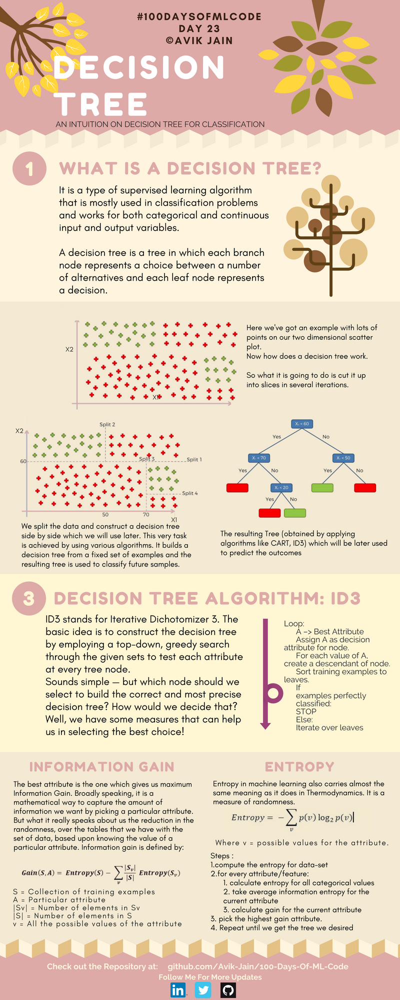
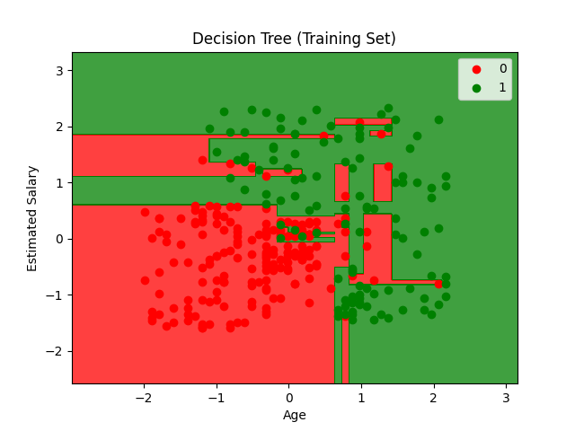
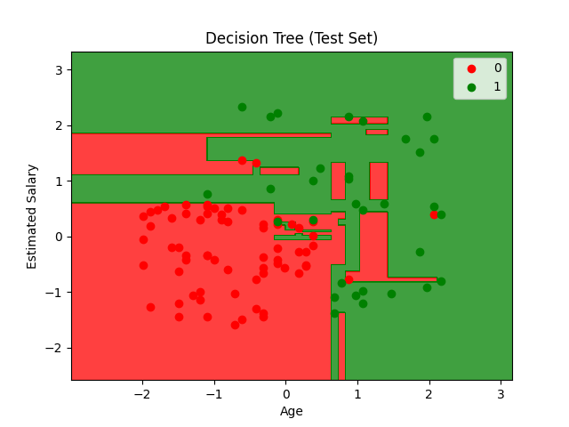

## Decision Trees (决策树)




**Decision Trees (决策树)** ，通过空间切割来分类数据。


​    **It is a type of supervised learning algorithm that is mostly used in classification problems and works for both categorical and continuous input and output variables. A decision tree is a tree in which each branch node represents a choice between a number of alternatives and each leaf node represents a decision.**

​    这是一种主要用于分类问题的监督学习算法，适用于分类型和连续型的输入及输出变量。决策树是一种树状结构，其中每个分支节点代表在多种备选方案之间做出的一种选择，而每个叶节点则代表一个决策。


- 中间散点图与树状图的解释：
  
  - “这里我们有一个二维散点图，上面有很多样本点。那么决策树是如何工作的呢？它要做的是通过多次迭代，将数据切成不同的片段。”
  
  - “我们将数据切分，并并排构建一个稍后会用到的决策树。这个任务是通过各种算法实现的。它从一组固定的样本中构建一棵决策树，生成的树将用于预测未来的样本。”
  
  - “最终生成的树（通过应用 CART、ID3 等算法获得），之后将被用来预测结果。”

- **空间切割**：图中的绿色加号和红色加号代表两类不同的数据。决策树在工作时，就像在坐标轴上“切蛋糕”。比如第一刀切在 $X_1 = 50$ 的地方，把数据分成左右两边；第二刀切在 $X_2 = 70$ 的地方。

- **树的对应关系**：图中的每一次“切分”（Split 1, Split 2），在右侧的树状图中就对应一个**判断节点**（如 $X_1 < 50$）。顺着 Yes 或 No 走下去，最终落到的红色或绿色方块就是**叶节点**（预测结果）。
  
  

---


#### Decision Tree Algorithm: ID3

ID3 全称为 *Iterative  Dichotomizer 3*（迭代二叉树3代）。其基本思想是通过在给定的集合中采用**自上而下、贪心搜索**的方式，在每个树节点上测试每个属性，从而构建决策树。

**循环流程图（Loop）**：

1. $A \rightarrow$ 寻找最佳属性。

2. 将 $A$ 分配为当前节点的决策属性。

3. 对于 $A$ 的每个取值，创建一个子节点。

4. 将训练样本分类到对应的叶子节点中。

5. **如果** 样本已被完美分类：**停止（STOP）**。

6. **否则**：在子节点上继续迭代。
- **自上而下与贪心**：决策树构建时，每一步都只看眼前哪一个特征能把数据分得最干净（局部最优），而不会去算计全局怎样切才最完美。

- **核心痛点**：我有那么多的特征（属性），我第一刀到底应该根据哪个特征切下去？这时候就需要数学指标——**熵**和**信息增益**来当裁判。
  
  

---


#### Information Gain


$Gain(S, A) = Entropy(S) - \sum_{v} \frac{|S_v|}{|S|} Entropy(S_v)$


- $S$ = 训练样本的集合
- $A$ = 某个特定的属性
- $|S_v|$ = 属性 $A$ 取值为 $v$ 的样本数量
- $|S|$ = 集合 $S$ 中的总样本数量
- $v$ = 属性 $A$ 的所有可能取值

$\text{信息增益} = \text{切分前的总混乱度} - \text{切分后的平均混乱度}$

> 信息增益越大，说明用属性 $A$ 来分类后，数据集一下子变得整洁了非常多。所以算法会优先选择**信息增益最大**的属性作为当前节点的分类标准。


#### Entropy


$Entropy = -\sum_{v} p(v) \log_2 p(v)$


熵代表一堆数据的**混乱程度**。如果一个盒子里全是红球（纯度极高），那么它的熵就是 $0$；如果盒子里红球、绿球、蓝球各占三分之一（极度混乱），那么它的熵就会很大。决策树的目标，就是**让切分后的子集熵越来越小（数据越来越纯）**。


---


数据集同 [逻辑回归](Logistic Regression/Logisitc Regression.md)


#### Code

```python
import numpy as np
import matplotlib.pyplot as plt
import pandas as pd
import os
from sklearn.model_selection import train_test_split
from sklearn.preprocessing import StandardScaler
from sklearn.tree import DecisionTreeClassifier
from sklearn.metrics import confusion_matrix, accuracy_score, classification_report
```

> 导入库
> `DecisionTreeClassifier` 决策树分类器

```python
def load_dataset(file_path):
    script_dir = os.path.dirname(os.path.abspath(__file__))
    full_path = os.path.join(script_dir, file_path)
    dataset = pd.read_csv(full_path)
    X = dataset.iloc[:, [2, 3]].values
    y = dataset.iloc[:, 4].values
    return X, y
```

> 加载数据

```python
def preprocess_data(X, y, test_size=0.25, random_state=0):
    X_train, X_test, y_train, y_test = train_test_split(
        X, y, test_size=test_size, random_state=random_state
    )

    sc = StandardScaler()
    X_train = sc.fit_transform(X_train)
    X_test = sc.transform(X_test)

    return X_train, X_test, y_train, y_test, sc
```

> 数据预处理
> 基于比较操作，不受数值尺度影响，不需要特征缩放

```python
def train_decision_tree(X_train, y_train, criterion='entropy', random_state=0, max_depth=None):
    classifier = DecisionTreeClassifier(
        criterion=criterion,
        random_state=random_state,
        max_depth=max_depth
    )
    classifier.fit(X_train, y_train)
    return classifier
```

> 训练决策树模型

```python
def evaluate_model(y_test, y_pred):
    cm = confusion_matrix(y_test, y_pred)
    accuracy = accuracy_score(y_test, y_pred)
    report = classification_report(y_test, y_pred)

    print("Confusion Matrix:")
    print(cm)
    print("\nAccuracy Score: {:.2f}%".format(accuracy * 100))
    print("\nClassification Report:")
    print(report)

    return cm, accuracy, report
```

> 评估模型

```python
def plot_decision_boundary(X, y, classifier, title):
    from matplotlib.colors import ListedColormap

    X_set, y_set = X, y
    X1, X2 = np.meshgrid(
        np.arange(start=X_set[:, 0].min() - 1, stop=X_set[:, 0].max() + 1, step=0.01),
        np.arange(start=X_set[:, 1].min() - 1, stop=X_set[:, 1].max() + 1, step=0.01)
    )

    plt.contourf(X1, X2, classifier.predict(np.array([X1.ravel(), X2.ravel()]).T).reshape(X1.shape),
                 alpha=0.75, cmap=ListedColormap(('red', 'green')))

    plt.xlim(X1.min(), X1.max())
    plt.ylim(X2.min(), X2.max())

    for i, j in enumerate(np.unique(y_set)):
        plt.scatter(X_set[y_set == j, 0], X_set[y_set == j, 1],
                    c=ListedColormap(('red', 'green'))(i), label=j)

    plt.title(title)
    plt.xlabel('Age')
    plt.ylabel('Estimated Salary')
    plt.legend()
    plt.show()
```

> 绘制决策边界
> 可视化决策树模型的分类边界

```python
if __name__ == "__main__":
    X, y = load_dataset('Social_Network_Ads.csv')

    X_train, X_test, y_train, y_test, sc = preprocess_data(X, y)

    classifier = train_decision_tree(X_train, y_train, criterion='entropy', random_state=0)

    y_pred = classifier.predict(X_test)

    evaluate_model(y_test, y_pred)

    plot_decision_boundary(X_train, y_train, classifier, 'Decision Tree (Training Set)')
    plot_decision_boundary(X_test, y_test, classifier, 'Decision Tree (Test Set)')
```


#### Results








```bash
Confusion Matrix:
[[62  6]
 [ 3 29]]

Accuracy Score: 91.00%

Classification Report:
              precision    recall  f1-score   support

           0       0.95      0.91      0.93        68
           1       0.83      0.91      0.87        32

    accuracy                           0.91       100
   macro avg       0.89      0.91      0.90       100
weighted avg       0.91      0.91      0.91       100
```


---


| 特性   | 决策树      | 逻辑回归  | SVM     | KNN  |
|:----:|:--------:|:-----:|:-------:|:----:|
| 决策边界 | 阶梯状（轴平行） | 直线    | 直线 / 曲线 | 不规则  |
| 分裂方式 | 信息增益     | 概率最大化 | 最大间隔    | 距离计算 |
| 特征缩放 | 不需要      | 需要    | 需要      | 需要   |
| 可解释性 | 非常高      | 高     | 中       | 低    |
| 训练速度 | 快        | 快     | 中等      | 无训练  |


> 决策树基于比较操作，不受数值尺度影响，不需要特征缩放
