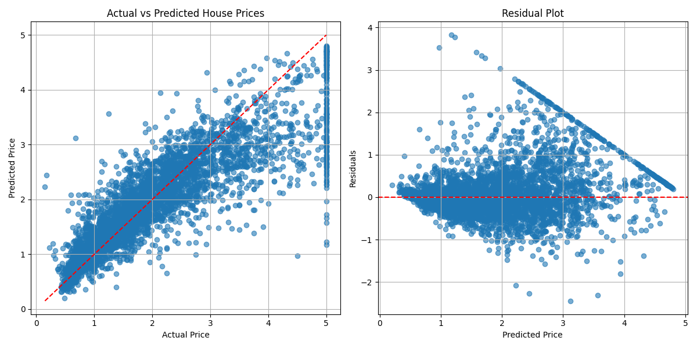

## Gradient-Boosting（梯度提升）


学习自 [梯度提升Gradient Boosting - 倒地 - 博客园](https://www.cnblogs.com/chirp/p/18188119)


**Gradient-Boosting (梯度提升)**，是一种强大的 ML 技术，用于回归和分类问题。

弱学习算法通常更易实现、更易训练。Boosting 系列算法的基本思想是将弱基础模型组合为一个强大的集成。

> 基本思想：
> 
> 不断重复生成弱学习器，每次生成弱学习器的目标是拟合先前累加模型的损失函数的负梯度， 使组合上该弱学习器后的累积模型损失往负梯度的方向减少。


---


约定符号：

- 输入 $x$ 输出 $y$ 

- 模型 $F_m(x)$

- 弱模型 $f_m(x)$

- 损失函数 $L(\hat{F}_m(x), y)$
  
  

损失函数相对于模型输出的导数


$g(x) = \frac{\partial L(\hat{F}(x), y)}{\partial \hat{F}(x)}$


为了训练出下一个弱模型 $f_m(x)$ 需要拟合模型 $\hat{F}_{m-1}(x)$ 输出的负梯度：


$\hat{f}_m = \arg\min_F \frac{1}{N} \sum_{i=1}^{N} (g(x) - f(x_i))^2$


> 很容易令人联想到均方误差 $L(x,y)=\frac{1}{n}\sum (x_i-y_i)^2$ 。可以说，获得弱模型就是使用 MSE 损失函数拟合负梯度 $-g(x)$ 。


借助弱模型 $f_m(x)$ 更新 $\hat{F}_{m-1}(x)$ ，获得下一个模型 $\hat{F}_m(x)$ 。其中 $\gamma$ 是学习率（一般在 0.01 或 0.001）：


$\hat{F}_m(x) = \hat{F}_{m-1}(x) + \gamma \hat{f}_m(x)$


如此，一直重复获得 $f_m(x)$ 和更新 $F_{m-1}(x)$ 的步骤，便可逐渐获得强大模型。


**第一个弱模型** 通常只是一个常数 $c$ 。找到一个使得损失 $L$ 最小的常数：


$\hat{f}_0 = \arg \min_c \frac{1}{N}\sum_{i=1}^{N}L(c, y_i)$


> 对于 MSE 损失，这个 $c$ 就是 $y$ 的均值。 


---


<span style="color:purple">算法流程：</span>


1. 初始化一个常数模型

2. 拟合模型的负梯度，获得一个弱模型

3. 用弱模型更新模型

4. 回到 step.2
   
   

#### Code

```python
import numpy as np
import pandas as pd
import matplotlib.pyplot as plt
from sklearn.tree import DecisionTreeRegressor
from sklearn.datasets import fetch_california_housing
from sklearn.model_selection import train_test_split
from sklearn.metrics import mean_squared_error, r2_score
import torch
from torch.distributions.normal import Normal
from torch.autograd import Variable
from typing import List, Optional
```

> 导入库

```python
class GaussianGradientBoosting:
    def __init__(self,
                 learning_rate: float = 0.025,
                 max_depth: int = 1,
                 n_estimators: int = 100):
        self.learning_rate = learning_rate
        self.max_depth = max_depth
        self.n_estimators = n_estimators
        self.init_mu = None
        self.mu_trees = []
        self.init_sigma = None
        self.sigma_trees = []
        self.is_trained = False
```

> 两棵树并行训练 ：一棵拟合均值，一棵拟合标准差
> 对数空间处理 ： `log(sigma)` 确保 sigma 始终为正

```python
    def predict(self, X: np.array) -> np.array:
        assert self.is_trained, "Model not trained yet!"
        mus = self._predict_mus(X).reshape(-1, 1)
        sigmas = np.exp(self._predict_log_sigmas(X)).reshape(-1, 1)
        return np.concatenate([mus, sigmas], axis=1)

    def predict_mean(self, X: np.array) -> np.array:
        assert self.is_trained, "Model not trained yet!"
        return self._predict_mus(X)

    def _predict_mus(self, X: np.array) -> np.array:
        output = np.full(len(X), self.init_mu)
        for tree in self.mu_trees:
            output += self.learning_rate * tree.predict(X)
        return output

    def _predict_log_sigmas(self, X: np.array) -> np.array:
        output = np.full(len(X), self.init_sigma)
        for tree in self.sigma_trees:
            output += self.learning_rate * tree.predict(X)
        return output

    def _predict_raw(self, X: np.array) -> np.array:
        mus = self._predict_mus(X).reshape(-1, 1)
        log_sigmas = self._predict_log_sigmas(X).reshape(-1, 1)
        return np.concatenate([mus, log_sigmas], axis=1)
```

> 最终预测 = 初始值 + Σ(学习率 × 每棵树的预测)

```python
    def fit(self, X: np.array, y: np.array) -> None:
        self._fit_initial(y)

        for i in range(self.n_estimators):
            y_pred = self._predict_raw(X)
            gradients = self._get_gradients(y, y_pred)

            mu_tree = DecisionTreeRegressor(max_depth=self.max_depth, random_state=i)
            mu_tree.fit(X, gradients[:, 0])
            self.mu_trees.append(mu_tree)

            sigma_tree = DecisionTreeRegressor(max_depth=self.max_depth, random_state=i)
            sigma_tree.fit(X, gradients[:, 1])
            self.sigma_trees.append(sigma_tree)

            if (i + 1) % 20 == 0:
                current_mu = self._predict_mus(X)
                mse = mean_squared_error(y, current_mu)
                print(f"Iteration {i+1}/{self.n_estimators} - MSE: {mse:.4f}")

        self.is_trained = True
```

> 训练方法

```
Step 1: 初始化
  μ₀ = mean(y)
  log(σ₀) = log(std(y))

Step 2: 迭代训练（每轮训练两棵树）
  for t in 1..n_estimators:
    计算当前预测：[μₜ₋₁, log(σₜ₋₁)]
    计算梯度：∇[log(P(y|μ,σ))]
    训练树：拟合梯度
    更新：μₜ = μₜ₋₁ + lr × tree_μ.predict(X)
    更新：log(σₜ) = log(σₜ₋₁) + lr × tree_σ.predict(X)

Step 3: 结束
  最终模型 = 初始值 + Σ(lr × 所有树)
```

```python
    def _get_gradients(self, y: np.array, y_pred: np.array) -> np.array:
        y_torch = torch.tensor(y, dtype=torch.float32)
        y_pred_torch = Variable(torch.tensor(y_pred, dtype=torch.float32), requires_grad=True)

        normal_dist = Normal(y_pred_torch[:, 0], torch.exp(y_pred_torch[:, 1]))
        log_prob = normal_dist.log_prob(y_torch).sum()
        log_prob.backward()

        return y_pred_torch.grad.numpy()
```

> 目标函数（最大化对数似然）：L = Σ log(N(y_i; μ_i, σ_i²))
> 梯度计算：
> ∂L/∂μ_i = (y_i - μ_i) / σ_i²    → 残差除以方差
> ∂L/∂log(σ_i) = ((y_i - μ_i)² / σ_i²) - 1  → 方差相关的梯度

```python
    def _fit_initial(self, y: np.array) -> None:
        assert not self.is_trained, "Model already trained!"
        self.init_mu = np.mean(y)
        self.init_sigma = np.log(np.std(y) + 1e-6)
```

> 初始化

```python
def load_data():
    housing = fetch_california_housing()
    X, y = housing.data, housing.target
    X_train, X_test, y_train, y_test = train_test_split(X, y, test_size=0.2, random_state=42)
    return X_train, X_test, y_train, y_test, housing.feature_names
```

> 加载数据

```python
def evaluate_model(y_true, y_pred):
    mse = mean_squared_error(y_true, y_pred)
    rmse = np.sqrt(mse)
    r2 = r2_score(y_true, y_pred)
    return mse, rmse, r2
```

> 评估模型

```python
def plot_results(y_test, y_pred, y_std):
    plt.figure(figsize=(12, 6))

    plt.subplot(1, 2, 1)
    plt.scatter(y_test, y_pred, alpha=0.6)
    plt.plot([y_test.min(), y_test.max()], [y_test.min(), y_test.max()], 'r--')
    plt.xlabel('Actual Price')
    plt.ylabel('Predicted Price')
    plt.title('Actual vs Predicted House Prices')
    plt.grid(True)

    plt.subplot(1, 2, 2)
    plt.scatter(y_pred, y_test - y_pred, alpha=0.6)
    plt.axhline(y=0, color='r', linestyle='--')
    plt.xlabel('Predicted Price')
    plt.ylabel('Residuals')
    plt.title('Residual Plot')
    plt.grid(True)

    plt.tight_layout()
    plt.show()
```

> 可视化结果

```python
if __name__ == "__main__":
    print("=== Loading California Housing Dataset ===")
    X_train, X_test, y_train, y_test, feature_names = load_data()
    print(f"Train samples: {len(X_train)}, Test samples: {len(X_test)}")
    print(f"Features: {feature_names}")

    print("\n=== Training Gaussian Gradient Boosting ===")
    model = GaussianGradientBoosting(
        learning_rate=0.05,
        max_depth=3,
        n_estimators=100
    )
    model.fit(X_train, y_train)

    print("\n=== Evaluating Model ===")
    y_pred_mean = model.predict_mean(X_test)
    y_pred = model.predict(X_test)
    y_pred_std = y_pred[:, 1]

    mse, rmse, r2 = evaluate_model(y_test, y_pred_mean)
    print(f"MSE: {mse:.4f}")
    print(f"RMSE: {rmse:.4f}")
    print(f"R² Score: {r2:.4f}")

    print("\n=== Visualizing Results ===")
    plot_results(y_test, y_pred_mean, y_pred_std)
```

#### Results




**Actual vs Predicted House Prices**

- 横轴 ：Actual Price（实际房价）

- 纵轴 ：Predicted Price（预测房价）

- 红色虚线 ：理想拟合线（y=x，即预测值=实际值）

**Residual Plot**

- 横轴 ：Predicted Price（预测房价）

- 纵轴 ：Residuals（残差 = y_true - y_pred）

- 红色虚线 ：残差=0（完美预测）

```
结果图分析：
  ⚠️ 存在明显的模式（漏斗形状）
  - 预测价格较低时：残差波动较小
  - 预测价格较高时：残差波动变大

这说明：
  - 模型对低价房的预测更准确
  - 模型对高价房的预测误差更大
  - 可能存在异方差（方差不稳定）
```


```bash
=== Loading California Housing Dataset ===
Train samples: 16512, Test samples: 4128
Features: ['MedInc', 'HouseAge', 'AveRooms', 'AveBedrms', 'Population', 'AveOccup', 'Latitude', 'Longitude']

=== Training Gaussian Gradient Boosting ===
Iteration 20/100 - MSE: 0.8006
Iteration 40/100 - MSE: 0.5668
Iteration 60/100 - MSE: 0.4366
Iteration 80/100 - MSE: 0.3636
Iteration 100/100 - MSE: 0.3273

=== Evaluating Model ===
MSE: 0.3531
RMSE: 0.5942
R² Score: 0.7305
```
