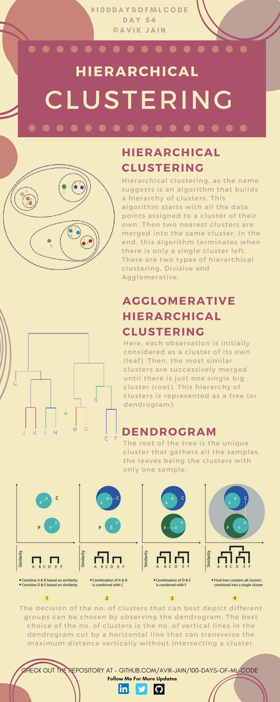
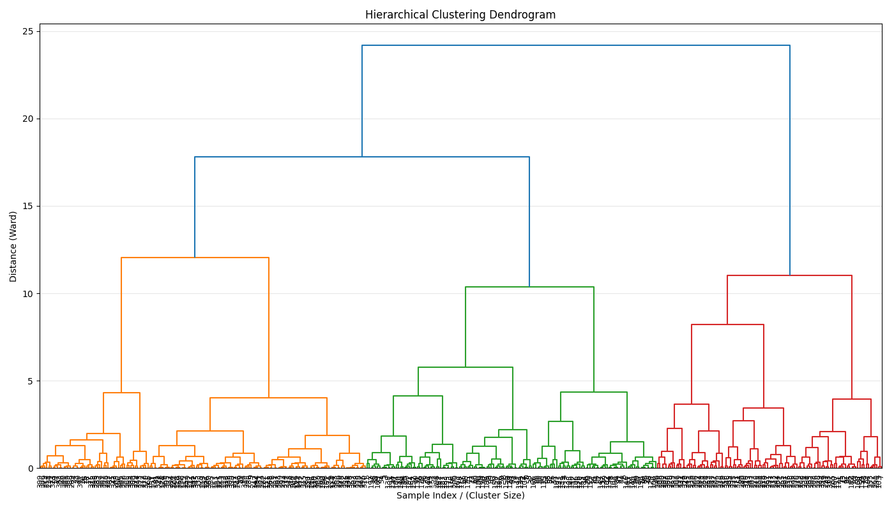
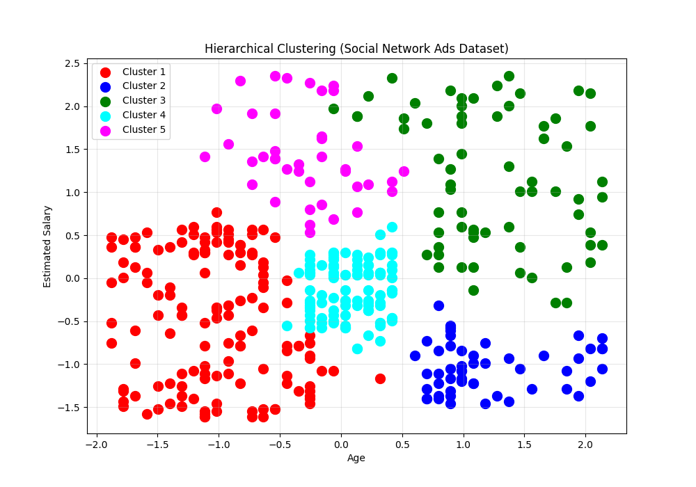

## 层次聚类（Hierarchical Clustering）



**层次聚类 (Hierarchical Clustering)**，是一类经典的无监督学习聚类算法。与 K-Means 不同，它不会直接给出 K 个簇，而是逐步构建一个“聚类树”。


#### Hierarchical Clustering

层次聚类是一种构建 **簇层级结构 (Hierarchy)** 的算法。

算法开始时：

- 每个数据点都被视为一个独立的簇。

随后：

- 最相近的两个簇被合并，不断重复这个过程。

最终：

- 所有数据都会被合并成一个大的簇。
  
  

层次聚类主要有两种：

1. Agglomerative（凝聚型，自底向上）
2. Divisive（分裂型，自顶向下）
   
   

---

开始时：

```
{小明}
{小红}
{小刚}
{小李}
{小王}
```

发现：

小明和小红最像

于是：

```
{小明, 小红}
{小刚}
{小李}
{小王}
```

再发现：

小李和小王最像

```
{小明, 小红}
{小刚}
{小李, 小王}
```

继续合并：

```
{小明, 小红, 小刚}
{小李, 小王}
```

最后：

```
{所有人}
```

这就是层次聚类。

---

#### Agglomerative Hierarchical Clustering

这里：每个样本最开始都被看作一个独立簇（叶节点）。

然后：最相似的簇不断被合并，直到最后形成一个大簇（根节点）。

整个过程可以表示为一棵树：Dendrogram（树状图）。


#### Dendrogram

树的根节点：包含所有样本。

树叶节点：每个叶节点代表一个样本。

```
          Root
         /    \
      ABCD    EF
      /  \    / \
     AB  CD  E   F
    / \
   A   B
```

树状图中的高度是两个簇合并时的距离（Distance）

例如：

```
A----B
```

距离很近，所以在很低的位置就合并。

```bash
AB ----------- C
```

距离较远，所以要到更高的位置才合并。

因此：树越高，说明两个簇差异越大。


---


**Step 1**

开始数据：

```
A B C D E F
```

发现：

* A和B最像
* D和E最像

合并：

```
AB
DE
C
F
```


**Step 2**

发现：AB 与 C 比较接近。

继续：

```
ABC
DE
F
```


**Step 3**

发现：DE 与 F 比较接近。

合并：

```
ABC
DEF
```


**Step 4**

最后：

```
ABCDEF
```

全部合并，得到完整树状图。


层次聚类：

不需要提前知道 K，先生成树，之后再切树。

最佳聚类数可以通过观察树状图获得。

通过画一条水平线切割树状图：

被切断的垂直分支数量就是聚类数。


---


#### Code

```python
import numpy as np
import matplotlib.pyplot as plt
import pandas as pd
import os
from sklearn.preprocessing import StandardScaler
from sklearn.cluster import AgglomerativeClustering
from scipy.cluster.hierarchy import dendrogram, linkage
```

> 导入库
> `AgglomerativeClustering` 凝聚型层次聚类算法
> `scipy.cluster.hierarchy` 绘制树状图（Dendrogram）

```python
def load_dataset(file_path):
    script_dir = os.path.dirname(os.path.abspath(__file__))
    full_path = os.path.join(script_dir, file_path)
    dataset = pd.read_csv(full_path)
    X = dataset.iloc[:, [2, 3]].values
    return X
```

> 加载数据集
> 无监督学习特点 ：只需要特征 X，不需要标签 y

```python
def preprocess_data(X):
    sc = StandardScaler()
    X_scaled = sc.fit_transform(X)
    return X_scaled, sc
```

> 数据预处理
> 标准化特征

```python
def plot_dendrogram(X_scaled, title='Dendrogram'):
    plt.figure(figsize=(14, 8))

    linked = linkage(X_scaled, method='ward')

    dendrogram(
        linked,
        orientation='top',
        distance_sort='descending',
        show_leaf_counts=True,
        leaf_rotation=90,
        leaf_font_size=8
    )

    plt.title('Hierarchical Clustering Dendrogram')
    plt.xlabel('Sample Index / (Cluster Size)')
    plt.ylabel('Distance (Ward)')
    plt.grid(True, axis='y', alpha=0.3)
    plt.tight_layout()
    plt.show()
```

> 绘制树状图（Dendrogram）
> 查看最佳聚类数


```python
def train_hierarchical_clustering(X_scaled, n_clusters=5, linkage='ward'):
    hc = AgglomerativeClustering(
        n_clusters=n_clusters,
        linkage=linkage
    )
    hc.fit(X_scaled)
    return hc
```

> 训练层次聚类模型

```python
def plot_clusters(X_scaled, hc, title):
    plt.figure(figsize=(10, 7))

    clusters = hc.labels_

    colors = ['red', 'blue', 'green', 'cyan', 'magenta', 'yellow', 'purple', 'orange']

    for i in range(hc.n_clusters):
        plt.scatter(
            X_scaled[clusters == i, 0],
            X_scaled[clusters == i, 1],
            s=100,
            c=colors[i % len(colors)],
            label=f'Cluster {i+1}'
        )

    plt.title(title)
    plt.xlabel('Age')
    plt.ylabel('Estimated Salary')
    plt.legend()
    plt.grid(True, alpha=0.3)
    plt.show()
```

> 可视化聚类结果

```python
if __name__ == "__main__":
    X = load_dataset('Social_Network_Ads.csv')

    X_scaled, sc = preprocess_data(X)

    print("=== Hierarchical Clustering Dendrogram ===")
    print("Use this to determine the optimal number of clusters")
    plot_dendrogram(X_scaled)

    print("\n=== Training Hierarchical Clustering with n_clusters=5 ===")
    hc = train_hierarchical_clustering(X_scaled, n_clusters=5)

    print(f"Number of clusters: {hc.n_clusters}")

    print("\n=== Visualizing Clusters ===")
    plot_clusters(X_scaled, hc, 'Hierarchical Clustering (Social Network Ads Dataset)')
```


#### Results




- 找最长的垂直线 ：看哪条垂直线最长且没有被其他水平线穿过
- 画水平线切割 ：在这条最长垂直线的高度画一条水平线
- 数交点数量 ：水平线与树的交点数 = 聚类数量



```
🔴红色 Cluster 1 年轻人、中低收入 
🔵蓝色 Cluster 2 年长者、低收入 
🟢绿色 Cluster 3 年长者、高收入 
🔵青色 Cluster 4 中等年龄、中等收入 
🟣洋红 Cluster 5 年轻人、高收入
```


---


#### 层次聚类 vs K-Means

| 特性      | K-Means | 层次聚类 |
| ------- | ------- | ---- |
| 是否需要指定K | 需要      | 不需要  |
| 输出结果    | K个簇     | 聚类树  |
| 可解释性    | 一般      | 很强   |
| 大数据效率   | 高       | 较低   |
| 聚类形状    | 倾向球形    | 更灵活  |
| 是否可回溯   | 否       | 是    |
| 算法复杂度   | O(nk)    | O(n³)（较慢） |