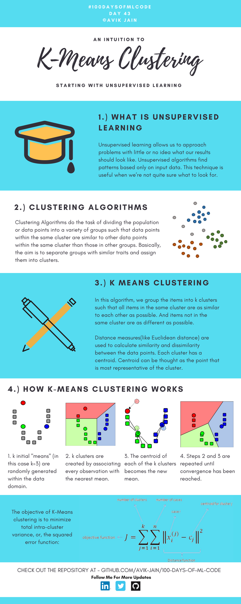
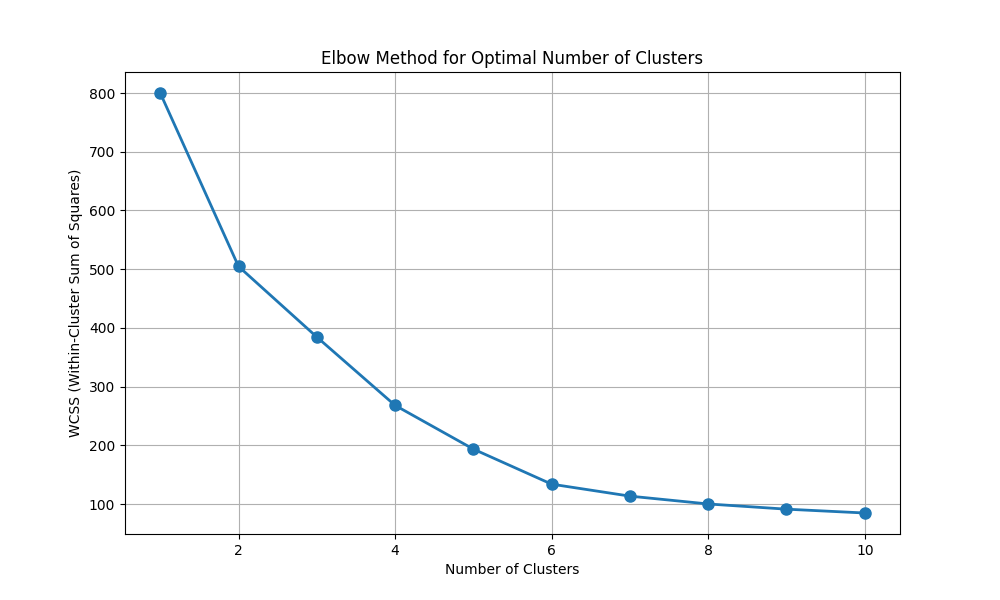
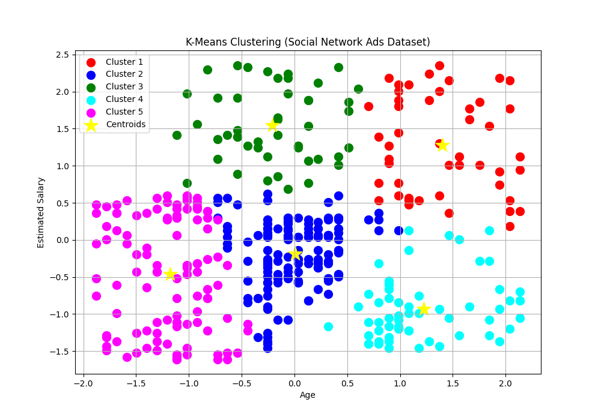

## K-Means Clustering（K均值聚类）



**K-Means Clustering（K均值聚类）** 是一种用 **无监督学习** 实现的分类算法，不需要标签。


#### Unsupervised Learning

无监督学习允许我们在不知道结果应该是什么样子的情况下解决问题。

无监督学习算法仅根据输入数据发现其中隐藏的模式（Patterns）。

当我们不确定要寻找什么规律时，这种技术特别有用。


#### Clustering Algorithms

聚类算法的任务是把总体数据划分为多个组（Clusters）。

同一个簇中的数据点彼此相似；

不同簇中的数据点尽量不同。


#### K Means Clustering

在 K-Means 聚类 算法中：

我们把数据划分为 K 个簇。

要求：

- 同一簇内的数据尽可能相似
- 不同簇之间的数据尽可能不同

利用距离（通常是欧氏距离）衡量样本间的相似程度。

每个簇都有一个中心点（Centroid）。

中心点可以理解为：

> 最能代表该簇的样本位置。


---


#### How K-Means Clustering Works

[可视化](https://shabal.in/visuals/kmeans/6.html)


**Step1 随机初始化 K 个中心点**

例如：K=3

随机选取：红色中心；绿色中心；蓝色中心


**Step2 分配样本**

计算每个点到三个中心的距离，选择最近的中心。

例如：点A：距离红色 = 1；距离绿色 = 5；距离蓝色 = 7

则：A属于红色簇。


**Step3 更新中心点**

每个簇重新计算均值：

$new~centroid=\frac{\sum x_i}{n}$

得到新的中心位置。


**Step4 重复**

继续：

- 分配样本
- 更新中心

直到中心点不再变化。

最终得到：红色簇 + 绿色簇 + 蓝色簇

这叫做：**收敛（Convergence）**


**目标函数：**  $J=\sum_{j=1}^{k}\sum^{n}_{i=1}||x_i^{(j)}-c_j||^2$

| 符号          | 含义          |
| ----------- | ----------- |
| $K$         | 聚类个数        |
| $n$         | 样本数         |
| $x_i^{(j)}$ | 第j个簇中的第i个样本 |
| $c_j$       | 第j个簇中心      |
| $J$         | 总误差         |

计算每个样本到所属中心点的距离平方并求和。

K-Means 的目标让 $J$ 尽可能小。

> 同一个簇中的点离中心越近越好。

因此：

- 簇内更紧凑（Intra-cluster variance 小）
- 聚类效果更好
  
  

---


<span style="color:purple">算法流程：</span>


```
        输入特征（年龄、收入）
                  ↓
        特征标准化（必须！）
                  ↓
        手肘法：尝试不同的 K（1-10）
                  ↓
        选择最优 K（比如 K=3 或 4）
                  ↓
        训练 K-Means：
          1. 初始化中心点
          2. 分配点到最近的簇
          3. 更新中心点
          4. 重复直到收敛
                  ↓
        得到 K 个簇 + 中心点
                  ↓
        可视化聚类结果
```


#### Code

```python
import numpy as np
import matplotlib.pyplot as plt
import pandas as pd
import os
from sklearn.preprocessing import StandardScaler
from sklearn.cluster import KMeans
```

> 导入库
> `sklearn.cluster` 聚类算法模块
> `KMeans` K-Means 聚类算法

```python
def load_dataset(file_path):
    script_dir = os.path.dirname(os.path.abspath(__file__))
    full_path = os.path.join(script_dir, file_path)
    dataset = pd.read_csv(full_path)
    X = dataset.iloc[:, [2, 3]].values
    return X
```

> 加载数据
> 无监督学习只需要 X ， 不需要 y (标签)

```python
def preprocess_data(X):
    sc = StandardScaler()
    X_scaled = sc.fit_transform(X)
    return X_scaled, sc
```

> 数据预处理 (特征缩放)

```python
def train_kmeans(X_scaled, n_clusters=5, random_state=0):
    kmeans = KMeans(
        n_clusters=n_clusters,  # 聚类数量（K值）
        init='k-means++',  # 智能初始化，避免局部最优
        max_iter=300,  # 最大迭代次数
        random_state=random_state # 随机种子，保证结果可复现
    )
    kmeans.fit(X_scaled)
    return kmeans
```

> 训练 K-Means 聚类算法
> K-Means++ 初始化步骤：
> 
> 1. 随机选第一个中心
> 2. 选距离第一个中心最远的点作为第二个中心
> 3. 选距离已选中心最远的点作为第三个中心
> 4. 重复直到选完 K 个中心

```python
def plot_clusters(X_scaled, kmeans, title):
    from matplotlib.colors import ListedColormap

    plt.figure(figsize=(10, 7))

    clusters = kmeans.predict(X_scaled)
    centroids = kmeans.cluster_centers_

    colors = ListedColormap(['red', 'blue', 'green', 'cyan', 'magenta'])

    for i in range(kmeans.n_clusters):
        plt.scatter(
            X_scaled[clusters == i, 0],
            X_scaled[clusters == i, 1],
            s=100,
            c=colors(i),
            label=f'Cluster {i+1}'
        )

    plt.scatter(
        centroids[:, 0],
        centroids[:, 1],
        s=300,
        c='yellow',
        marker='*',
        label='Centroids'
    )

    plt.title(title)
    plt.xlabel('Age')
    plt.ylabel('Estimated Salary')
    plt.legend()
    plt.grid(True)
    plt.show()
```

> 可视化聚类结果
> 彩色点：不同的簇（红、蓝、绿、青、洋红）
> 黄色★：每个簇的中心点（Centroid）

```python
def plot_elbow_method(X_scaled, max_clusters=10):
    from sklearn.cluster import KMeans
    import matplotlib.pyplot as plt

    wcss = []
    for i in range(1, max_clusters + 1):
        kmeans = KMeans(n_clusters=i, init='k-means++', random_state=0)
        kmeans.fit(X_scaled)
        wcss.append(kmeans.inertia_)

    plt.figure(figsize=(10, 6))
    plt.plot(range(1, max_clusters + 1), wcss, marker='o', linewidth=2, markersize=8)
    plt.title('Elbow Method for Optimal Number of Clusters')
    plt.xlabel('Number of Clusters')
    plt.ylabel('WCSS (Within-Cluster Sum of Squares)')
    plt.grid(True)
    plt.show()
```

> 手肘法（Elbow Method）
> WCSS = Within-Cluster Sum of Squares（簇内平方和）

```python
if __name__ == "__main__":
    X = load_dataset('Social_Network_Ads.csv')

    X_scaled, sc = preprocess_data(X)

    print("=== Finding Optimal Number of Clusters (Elbow Method) ===")
    plot_elbow_method(X_scaled, max_clusters=10)

    print("\n=== Training K-Means with n_clusters=5 ===")
    kmeans = train_kmeans(X_scaled, n_clusters=5, random_state=0)

    print(f"Number of clusters: {kmeans.n_clusters}")
    print(f"WCSS (Inertia): {kmeans.inertia_:.2f}")

    print("\n=== Cluster Centers (Scaled Features) ===")
    print(kmeans.cluster_centers_)

    print("\n=== Visualizing Clusters ===")
    plot_clusters(X_scaled, kmeans, 'K-Means Clustering (Social Network Ads Dataset)')
```


#### Results




**Elbow Method（手肘法）**

这张图帮你选择最优的聚类数量 K！

横轴： Number of Clusters（聚类数量）

- 1, 2, 3, 4, 5, 6, 7, 8, 9, 10 个簇

纵轴： WCSS（Within-Cluster Sum of Squares，簇内平方和）

- 衡量每个簇内的点与中心点的总距离
- WCSS 越小 → 簇越紧凑 → 聚类效果越好

```
找"手肘"位置！
- 肘部位置 = WCSS 下降明显变缓的地方
- 你的图中，手肘大约在 3-4 个簇左右
- 说明最优 K 可能是 3 或 4

肘部原理：
  K=1：所有点一个簇 → WCSS 很大
  K=2：分成两簇 → WCSS 下降很多
  K=3：分成三簇 → WCSS 继续下降
  K=4：分成四簇 → WCSS 下降变缓
  K=5,6...：WCSS 下降越来越慢
  K=样本数：每个点一个簇 → WCSS=0（但没用）
```

结论： 从这张图看，3 或 4 个簇可能是最优选择！



**K-Means Clustering（聚类结果）**

```
🔴 Cluster 1（红色）：年轻人、高收入
🔵 Cluster 2（蓝色）：中等年龄、中等收入
🟢 Cluster 3（绿色）：年长者、中高收入
🔵 Cluster 4（青色）：年长者、中低收入
🟣 Cluster 5（洋红）：年轻人、低收入
```

★ 每个簇的"中心"或"代表"
★ 是该簇所有点的平均值位置
★ 这是 K-Means 算法的核心输出

横轴：Age（年龄，已标准化）
纵轴：Estimated Salary（预估收入，已标准化）


---


**有监督 vs 无监督对比**

| 特性     | 分类（有监督）   | 聚类（无监督）      |
|:------:|:---------:|:------------:|
| 需要标签 y | ✅ 需要      | ❌ 不需要        |
| 目标     | 预测类别      | 发现模式/分组      |
| 评价方法   | 准确率、F1 分数 | WCSS、轮廓系数    |
| 例子     | 逻辑回归、随机森林 | K-Means、层次聚类 |

**K-Means 的优缺点**

优点：

✓ 简单易理解
✓ 计算效率高
✓ 适用于大数据集
✓ 结果可解释

缺点：

✗ 需要预先指定 K（簇的数量）
✗ 对初始中心点敏感（用 K-Means++ 解决）
✗ 对异常值敏感
✗ 假设簇是圆形的，且大小相似
