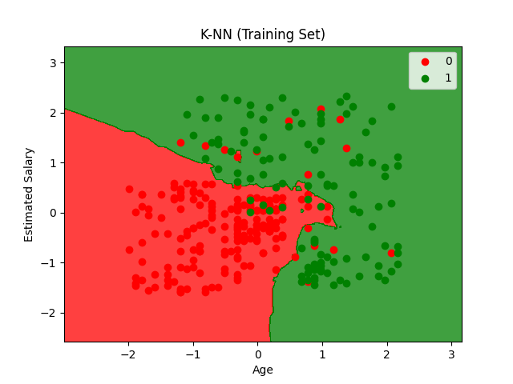
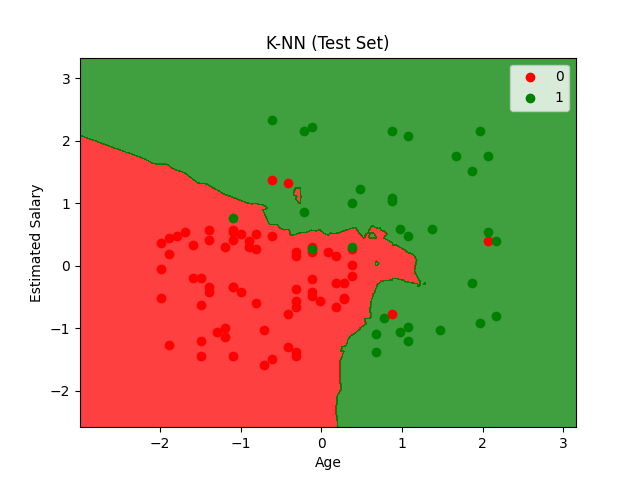

## K Nearest Neighbours（K近邻算法）


**K Nearest Neighbours（K近邻算法）**，最简单的多分类算法之一。

可用于：

- 分类 (classification)

- 回归 (regression)
  
  

**K-Nearest Neighbor algorithm is a simple yet most used classification algorithm.It can also be used for regression.KNN is non-parametric and instance-based**

K近邻算法是一种简单但非常常用的分类算法，它也可以用于回归任务。KNN 是一种“非参数”和“基于实例”的算法。

- **非参数**
  不假设数据服从某种固定分布
  
  - 不要求数据必须是正态分布
  
  - 不需要提前假设模型形式

- **基于实例**
  KNN 不会像神经网络那样“训练一个模型”，它只是把训练数据记下来。
  
  

---


#### How Does k-NN Algorithm Work?

> 距离近的数据往往属于同一类别。

有一个新的点（灰色点）：

它可能属于：

* 绿色类
* 橙色类

KNN 会：

1. 计算它与所有点的距离
2. 找最近的 K 个点
3. 看哪一类数量最多
4. 用“多数投票”决定类别
   
   

#### Making Predictions

为了对一个没有标签的数据进行分类：

1. 计算它与所有已标注数据的距离
2. 找到最近的 K 个邻居
3. 统计这些邻居的类别
4. 多数类别作为最终预测结果
   
   

#### The Distance

距离度量（Distance Metric）

- 欧氏距离（Euclidean Distance）
  $d=\sqrt{(x_2-x_1)^2+(y_2-y_1)^2}$

- Hamming Distance（汉明距离）
  用于字符串和二进制数据
  e.g. `10101` 和 `11100` 不同的位置数量为3。

- Manhattan Distance（曼哈顿距离）
  $d=∣x_2​−x_1​∣+∣y_2​−y_1​∣$

- Minkowski Distance（闵可夫斯基距离）
  
  - 当 p = 1：曼哈顿距离
    
    $d=∣x_2​−x_1​∣+∣y_2​−y_1​∣$
  
  - 当 p = 2：欧几里得距离（最常用）
      $d=\sqrt{(x_2-x_1)^2+(y_2-y_1)^2}$
  
  - 当 p → $\infin$：切比雪夫距离
      $d = \max(|x_1-x_2|, |y_1-y_2|)$
  
  

#### Value of k

- K 过小
  
  - 对噪声非常敏感
  
  - 容易过拟合

- K 过大
  
  - 分类边界变模糊
  
  - 计算量变大
  
  - 容易欠拟合
    
    

---


<span style="color:purple">算法流程：</span>


```
训练数据
   ↓
保存所有样本
   ↓
输入一个新数据
   ↓
计算与所有点距离
   ↓
找最近K个邻居
   ↓
投票
   ↓
输出类别
```


数据集同 [逻辑回归](Logistic Regression/Logisitc Regression.md)

#### Code

```python
import numpy as np
import matplotlib.pyplot as plt
import pandas as pd
import os
from sklearn.model_selection import train_test_split
from sklearn.preprocessing import StandardScaler
from sklearn.neighbors import KNeighborsClassifier
from sklearn.metrics import confusion_matrix, accuracy_score, classification_report
```

> 导入库

```python
def load_dataset(file_path):
    script_dir = os.path.dirname(os.path.abspath(__file__))
    full_path = os.path.join(script_dir, file_path)
    dataset = pd.read_csv(full_path)
    X = dataset.iloc[:, [2, 3]].values  # 年龄、预估收入
    y = dataset.iloc[:, 4].values       # 是否购买
    return X, y
```

> 加载数据

```python
def preprocess_data(X, y, test_size=0.25, random_state=0):
    X_train, X_test, y_train, y_test = train_test_split(X, y, test_size=test_size, random_state=random_state)

    sc = StandardScaler()
    X_train = sc.fit_transform(X_train)
    X_test = sc.transform(X_test)

    return X_train, X_test, y_train, y_test, sc
```

> 数据预处理

```python
def train_knn_model(X_train, y_train, n_neighbors=5, metric='minkowski', p=2):
    classifier = KNeighborsClassifier(
      n_neighbors=n_neighbors,  # K值：选择5个最近邻居
      metric=metric,            # 距离度量：
      p=p)                      # p=2表示欧几里得距离
    classifier.fit(X_train, y_train)
    return classifier
```

> 训练 KNN 模型

```python
def evaluate_model(y_test, y_pred):
    cm = confusion_matrix(y_test, y_pred)
    accuracy = accuracy_score(y_test, y_pred)
    report = classification_report(y_test, y_pred)

    print("Confusion Matrix:")
    print(cm)
    print("\nAccuracy Score: {:.2f}%".format(accuracy * 100))
    print("\nClassification Report:")
    print(report)

    return cm, accuracy, report
```

> 评估模型

```python
def plot_decision_boundary(X, y, classifier, title):
    from matplotlib.colors import ListedColormap

    X_set, y_set = X, y
    X1, X2 = np.meshgrid(np.arange(start=X_set[:, 0].min() - 1, stop=X_set[:, 0].max() + 1, step=0.01),
                         np.arange(start=X_set[:, 1].min() - 1, stop=X_set[:, 1].max() + 1, step=0.01))

    plt.contourf(X1, X2, classifier.predict(np.array([X1.ravel(), X2.ravel()]).T).reshape(X1.shape),
                 alpha=0.75, cmap=ListedColormap(('red', 'green')))

    plt.xlim(X1.min(), X1.max())
    plt.ylim(X2.min(), X2.max())

    for i, j in enumerate(np.unique(y_set)):
        plt.scatter(X_set[y_set == j, 0], X_set[y_set == j, 1],
                    c=ListedColormap(('red', 'green'))(i), label=j)

    plt.title(title)
    plt.xlabel('Age')
    plt.ylabel('Estimated Salary')
    plt.legend()
    plt.show()
```

> 可视化决策边界

```python
if __name__ == "__main__":
    # Load dataset
    X, y = load_dataset('Social_Network_Ads.csv')

    # Preprocess data
    X_train, X_test, y_train, y_test, sc = preprocess_data(X, y)

    # Train KNN model
    classifier = train_knn_model(X_train, y_train, n_neighbors=5, metric='minkowski', p=2)

    # Predict
    y_pred = classifier.predict(X_test)

    # Evaluate
    evaluate_model(y_test, y_pred)

    # Visualize results
    plot_decision_boundary(X_train, y_train, classifier, 'K-NN (Training Set)')
    plot_decision_boundary(X_test, y_test, classifier, 'K-NN (Test Set)')
```

#### Results







```bash
Confusion Matrix:
[[64  4]
 [ 3 29]]

Accuracy Score: 93.00%

Classification Report:
    accuracy                           0.93       100
   macro avg       0.92      0.92      0.92       100
weighted avg       0.93      0.93      0.93       100
```


|     特性     |            KNN             |        逻辑回归         |
| :----------: | :------------------------: | :---------------------: |
|     类型     | 基于实例（Instance-based） |  参数化（Parametric）   |
|     训练     |   无训练过程（惰性学习）   | 有训练过程（学习参数）  |
|   决策边界   |       非线性、不规则       |          线性           |
|   预测速度   |   慢（需要计算所有距离）   |   快（直接计算公式）    |
|   内存消耗   |   高（存储所有训练数据）   |    低（只存储参数）     |
| 对特征的缩放 |    非常敏感（必须缩放）    | 需要（但不如 KNN 敏感） |

