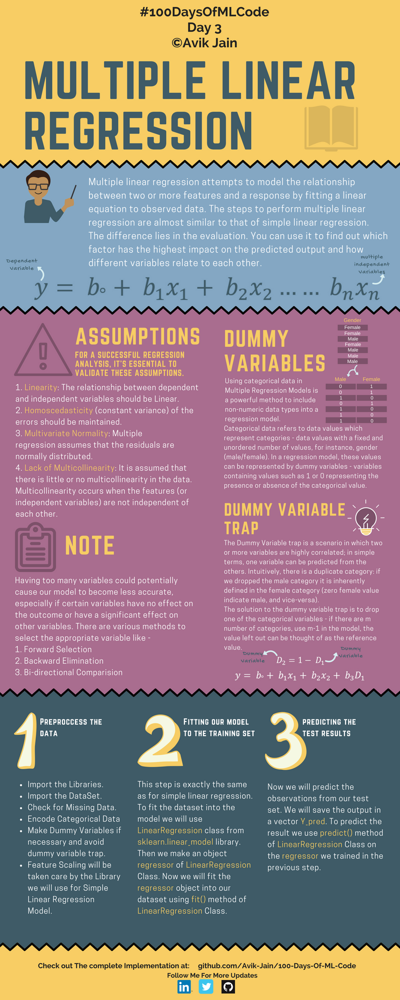
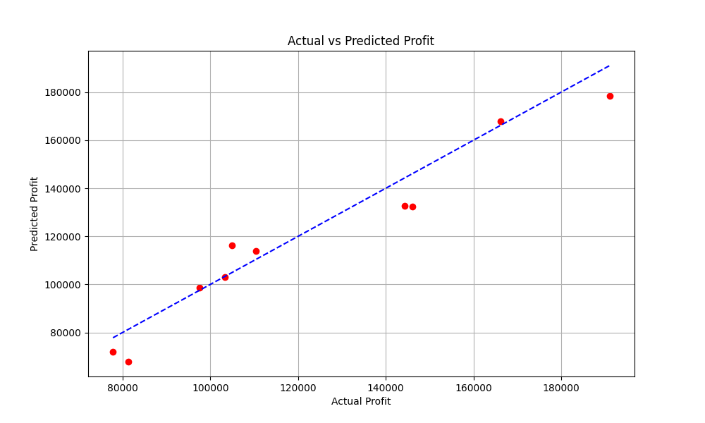
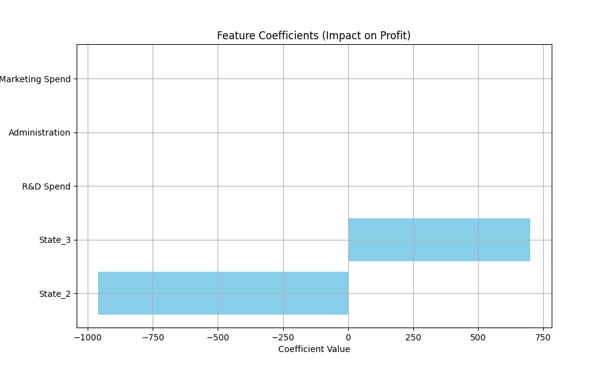
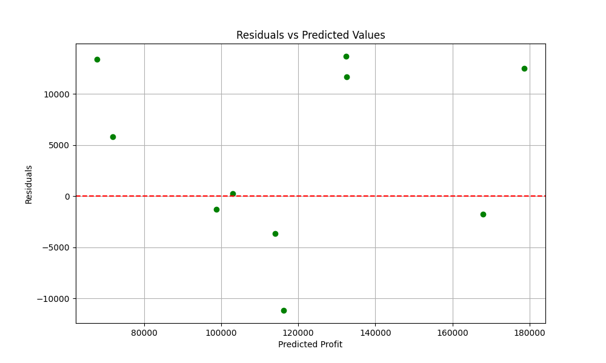

## Multiple Linear Regression（多元线性回归）



**Multiple Linear Regression (多元线性回归)**，它是简单线性回归的升级版。

核心目标：

> 用多个输入变量一起预测结果


**Multiple linear regression attempts to model the relationship between two or more features and a response by fitting a linear equation to observed data.**

多元线性回归通过拟合一个线性方程，来建模多个特征与目标结果之间的关系。


$$
y = b_0 + b_1x_1 + b_2x_2 + ⋯ + b_nx_n
$$


- $y$：预测值 (因变量 / 输出)
* $b_0$：截距 (intercept)
* $b_i$：第 i 个特征的权重
* $x_i$：第 i 个输入特征 (自变量)
  
  

E.g.

$Price=2×Area−0.5×Age+10×Location$

- 面积越大价格越高

- 房龄越老价格下降

- 地段好价格提升

---


#### Assumptions

这是多元线性回归最重要的理论部分。

1. **Linearity** --  线性关系
   输入变量和输出变量之间应该是线性关系。

2. **Homoscedasticity** -- 同方差性
   误差的方差应保持稳定。

3. **Multivariate Normality** -- 多元正态性
   残差（预测误差）应接近正态分布 $Residual=y_{true}−y_{pred}$

4. **Lack of Multicollinearity** -- 避免<u>多重共线性</u> (多个特征彼此高度相关)
   避免出现意义相同或相关的两个特征。
   
   

#### Dummy Variables

这是多元回归中的重要技巧。

将字符串转化为数字

e.g.

| Gender | Male | Female |
| ------ | ---- | ------ |
| Male   | 1    | 0      |
| Female | 0    | 1      |


#### Dummy Variable Trap

如果将性别用上述处理，会出现 **多重共线性** 的问题。

因为 $Female = 1 - Male$，两个变量完全相关。

保留单变量即可 (`Male = 0` 代表 `Female`)

| Male |
| ---- |
| 1    |
| 0    |


#### Notes

变量太多可能降低模型准确率。

有些变量：

- 根本没用
- 或者和别的变量重复

会导致：

- 训练慢
- 过拟合
- 参数混乱

<span style="color:purple">特征选择方法：</span>

1. **Forward Selection** -- 前向选择
   从空模型开始：
   
   - 每次加入最有用的变量。

2. **Backward Elimination** -- 后向消除
   从全部变量开始：
   
   - 每次删除最没用的变量。

3. **Bi-directional Comparison** -- 双向选择
   边加入边删除。
   
   

---


<span style="color:purple">算法流程：</span>


#### STEP 1：Preprocess the Data

数据预处理

- 导入库
- 导入数据
- 处理缺失值
- 编码分类变量
- 创建 Dummy Variables
- 避免 Dummy Trap
- 特征缩放
  
  

#### STEP 2：Fitting Our Model to the Training Set

```python
from sklearn.linear_model import LinearRegression

regressor = LinearRegression()

regressor.fit(X_train, y_train)
```


#### STEP 3：Predicting the Result

```python
y_pred = regressor.predict(X_test)
```


---


#### Code

```python
# Step 1: Data Preprocessing
## Importing the libraries
import pandas as pd
import numpy as np
import matplotlib.pyplot as plt
from pathlib import Path
```

> 导入库：
> 
> - pandas - 数据处理
> - numpy - 数值计算
> - matplotlib.pyplot - 可视化
> - Path - 路径处理

```python
## Importing the dataset
csv_path = Path(__file__).resolve().parent / '50_Startups.csv'
dataset = pd.read_csv(str(csv_path))
X = dataset.iloc[:, :-1].values
Y = dataset.iloc[:, 4].values
```

> 导入数据：
> 
> - 从 CSV 文件导入数据
> - 分离特征变量和目标变量

```python
## Encoding Categorical data
from sklearn.preprocessing import OneHotEncoder
from sklearn.compose import ColumnTransformer

ct = ColumnTransformer([('encoder', OneHotEncoder(), [3])], remainder='passthrough')
X = ct.fit_transform(X)
```

> 为什么需要编码？
> 
> - 机器学习模型只能处理数值数据
> - `State` 列是字符串（如 New York, California, Florida）
> - 需要转换为数字格式（虚拟变量/Dummy Variables）

```python
## Avoiding the Dummy Variable Trap
X = X[:, 1:]
```

> 避免 Dummy Trap：
> 
> - 保留单变量即可 (`Male = 0` 代表 `Female`)

```python
## Splitting the dataset into the Training set and Test set
from sklearn.model_selection import train_test_split
X_train, X_test, Y_train, Y_test = train_test_split(X, Y, test_size=0.2, random_state=0)
```

> 划分训练集和测试集：
> 
> - test_size=0.2 - 20% 数据作为测试集
> - random_state=0 - 固定随机种子，保证结果可复现

```python
# Step 2: Fitting Multiple Linear Regression to the Training set
from sklearn.linear_model import LinearRegression
regressor = LinearRegression()
regressor.fit(X_train, Y_train)
```

> 训练多元线性回归模型

```python
# Step 3: Predicting the Test set results
y_pred = regressor.predict(X_test)
```

> 使用训练好的模型对测试集进行预测

```python
# Step 4: Visualization
## Visualize actual vs predicted values
plt.figure(figsize=(10, 6))
plt.scatter(Y_test, y_pred, color='red')
plt.plot([Y_test.min(), Y_test.max()], [Y_test.min(), Y_test.max()], 'b--')

plt.title('Actual vs Predicted Profit')
plt.xlabel('Actual Profit')
plt.ylabel('Predicted Profit')
plt.grid(True)
plt.show()
```

> - 红色散点：实际利润 vs 预测利润
> - 蓝色虚线：理想拟合线（预测值=实际值）
> - 点越靠近虚线，模型预测越准确

```python
## Feature importance (coefficients)
feature_names = ['State_2', 'State_3', 'R&D Spend', 'Administration', 'Marketing Spend']
coefficients = regressor.coef_

plt.figure(figsize=(10, 6))
plt.barh(feature_names, coefficients, color='skyblue')
plt.title('Feature Coefficients (Impact on Profit)')
plt.xlabel('Coefficient Value')
plt.grid(True)
plt.show()
```

> 展示每个特征对利润的影响程度：
> 
> - 正系数 ：投入增加会使利润增加
> - 负系数 ：投入增加会使利润减少

```python
## Residual plot
residuals = Y_test - y_pred
plt.figure(figsize=(10, 6))
plt.scatter(y_pred, residuals, color='green')
plt.axhline(y=0, color='r', linestyle='--')
plt.title('Residuals vs Predicted Values')
plt.xlabel('Predicted Profit')
plt.ylabel('Residuals')
plt.grid(True)
plt.show()
```

> 残差 = 实际值 - 预测值
> 
> - 理想情况下，残差应随机分布在0附近
> - 如果出现明显模式，说明模型假设可能不成立

```python
## Print model performance metrics
from sklearn.metrics import r2_score, mean_squared_error

r2 = r2_score(Y_test, y_pred)                # R²值
mse = mean_squared_error(Y_test, y_pred)    # 均方误差
rmse = np.sqrt(mse)                        # 均方根误差

print(f"R-squared: {r2:.4f}")
print(f"Mean Squared Error: {mse:.2f}")
print(f"Root Mean Squared Error: {rmse:.2f}")
print(f"\nIntercept: {regressor.intercept_:.2f}")
print("Coefficients:")
for name, coef in zip(feature_names, coefficients):
    print(f"  {name}: {coef:.4f}")

```

| 指标  |        含义        | 理想值 |
| :---: | :----------------: | :----: |
| $R^2$ | 模型解释的方差比例 | 接近 1 |
|  MSE  |  平均预测误差平方  | 接近 0 |
| RMSE  |    平均预测误差    | 接近 0 |


#### Results



**实际值 vs 预测值**

- <span style="color:red">红色散点</span>贴近<span style="color:blue">蓝色对角线</span>，说明预测值和实际值非常接近
- 模型预测精度高



**特征系数**

- 研发投入 对利润影响最大（系数最大）
- 地区因素 影响很小（系数接近0）



**残差图**

- 残差随机分布在0附近，没有明显模式
- 说明模型假设（线性关系、同方差）成立
  
  

```bash
R-squared: 0.9347                    # 模型解释了93.47%的利润方差，拟合效果非常好
Mean Squared Error: 83502864.03        # 平均预测误差平方
Root Mean Squared Error: 9137.99    # 平均预测误差约9,138美元

Intercept: 42554.17    # ← 基础利润（无任何投入时）
Coefficients:
  State_2: -959.2842        # 相对于基准州，利润减少约959美元
  State_3: 699.3691            # 相对于基准州，利润增加约699美元
  R&D Spend: 0.7735            # 研发每投入1美元，利润增加约0.77美元（影响最大）
  Administration: 0.0329    # 管理费用每投入1美元，利润增加约0.03美元
  Marketing Spend: 0.0366    # 营销每投入1美元，利润增加约0.04美元
```


## 💡 结论

1. 研发投入是最重要的因素 ，每投入1美元能带来约0.77美元利润
2. 地区对利润影响很小 ，三个州之间差异不大
3. 模型拟合优秀 ，R²达到93.47%，可以有效预测创业公司利润
