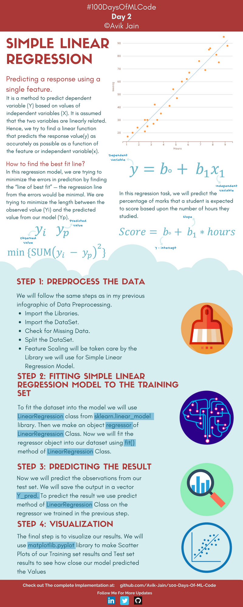
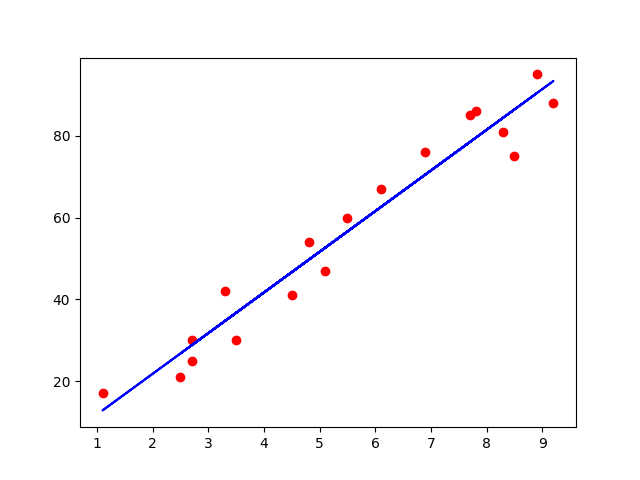
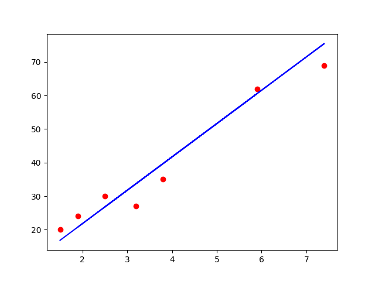

## Simple Linear Regression    简单线性回归



**Simple Linear Regression（简单线性回归）**，是机器学习里最基础的监督学习算法之一。

核心目标是：

> 用一个变量 $X$ 去预测另一个变量 $Y$

**Predicting a response using a single feature.**

仅使用单个输入变量 (特征) 来预测结果

$$
y = b_0 + b_1 x_1
$$

- $y$：预测值 (因变量 / 输出)
- $x_1$：输入特征 (自变量)
- $b_0$：截距 (intercept)
- $b_1$：斜率 (slope)

E.g.

$Score = b_0 + b_1 \times hours$

表示为 `学生的成绩 = 截距 + 学习时间 × 权重 `&#x20;

<span style="color:purple">关键问题：</span> **如何找到最佳的拟合线**

> 找到一条 “最佳拟合线”，使得预测误差最小

- 预测误差： $y_i - y_p$，即 `真实值 - 预测值`
- 目标函数： $min {\sum(y_i-y_p)^2}$，使得 `让所有误差平方和最小`，即 **最小二乘法 (Least Squares)**

***

<span style="color:purple">算法流程：</span>

#### STEP 1：Preprocess the Data

数据预处理阶段

- 导入库（Import Libraries）
- 导入数据集（Import Dataset）
- 检查缺失值（Missing Data）
- 划分训练集和测试集（Split Dataset）
- 特征缩放（Feature Scaling）

#### STEP 2：Fitting Simple Linear Regression Model to the Training Set

使用 `Scikit-Learn` 机器学习库 【需要配置 `pip install scikit-learn`】

```python
from sklearn.linear_model import LinearRegression

regressor = LinearRegression()

regressor.fit(X_train, y_train)
```

- 创建回归模型
- 用训练数据训练

#### STEP 3：Predicting the Result

使用训练好的模型预测测试集结果

```python
y_pred = regressor.predict(X_test)
```

#### STEP 4：Visualization

使用 matplotlib 绘制散点图和回归线 【需要配置 `pip install matplotlib`】

```python
plt.scatter(X, y)
plt.plot(X, y_pred)
```

- 看预测效果好不好
- 看数据是否接近直线

***

#### Code

```python
# Step 1: Data Preprocessing
import pandas as pd
import numpy as np
import matplotlib.pyplot as plt
from pathlib import Path
```

> 导入必要的库：
> 
> - pandas - 数据处理
> - numpy - 数值计算
> - matplotlib.pyplot - 数据可视化
> - Path - 路径处理

```python
csv_path = Path(__file__).parent / 'studentscores.csv'
dataset = pd.read_csv(csv_path)
```

> 加载数据：
> 
> - Path(__file__) 获取当前脚本路径
> - .parent 获取脚本所在目录
> - / 'studentscores.csv' 拼接数据文件路径
> - 使用 pd.read_csv() 读取 CSV 文件

```python
X = dataset.iloc[ : ,   : 1 ].values # 学习时间
Y = dataset.iloc[ : , 1 ].values # 成绩
```

> 提取特征：
> 
> - dataset.iloc[:, :1] - 取所有行、第一列（学习时间 Hours）
> - dataset.iloc[:, 1] - 取所有行、第二列（成绩 Score）
> - .values - 转换为 NumPy 数组

```python
from sklearn.model_selection import train_test_split
X_train, X_test, Y_train, Y_test = train_test_split( X, Y, test_size = 1/4, random_state = 0)
```

> 划分数据集：
> 
> - train_test_split() - 划分训练集和测试集
> - test_size=1/4 - 25% 作为测试集
> - random_state=0 - 随机种子，保证结果可复现

```python
# Step 2: Fitting Simple Linear Regression Model to the training set
from sklearn.linear_model import LinearRegression
regressor = LinearRegression()
regressor = regressor.fit(X_train, Y_train)
```

> 训练线性回归模型：
> 
> - 创建 LinearRegression() 实例
> - .fit(X_train, Y_train) - 用训练数据训练模型
> - 模型学习最佳拟合线的斜率和截距

```python
# Step 3: Predecting the Result
Y_pred = regressor.predict(X_test)
```

> 预测：
> 
> - .predict(X_test) - 用训练好的模型预测测试集
> - Y_pred 是模型预测的成绩数组

```python
# Step 4: Visualization
# Visualising the Training results
plt.scatter(X_train , Y_train, color = 'red')
plt.plot(X_train , regressor.predict(X_train), color ='blue')
plt.show()
```

> 训练集结果：

- 红色点表示实际的学习时间和成绩关系
- 蓝色线是模型学到的最佳拟合线

```python
# Visualizing the Test results
plt.scatter(X_test , Y_test, color = 'red')
plt.plot(X_test , regressor.predict(X_test), color ='blue')
plt.show()
```

> 测试集结果：
> 
> - 红色点表示测试数据的真实值
> - 用于评估模型的泛化能力

#### Results



**训练集可视化**

- <span style="color:red">红色散点</span>：训练数据 (用于训练模型的样本)
- <span style="color:blue">蓝色直线</span>：线性回归模型在训练集上的拟合线
- 横轴：学习时间
- 纵轴：考试分数



**测试集可视化**

- <span style="color:red">红色散点</span>：测试数据（未参与模型训练，用于评估模型）
- <span style="color:blue">蓝色直线</span>：同样的线性回归拟合线
- 测试数据点较少（因为测试集只占25%）
- 测试点分布在2小时到7.5小时之间
- 所有测试点都比较接近回归线，说明模型泛化能力较好
