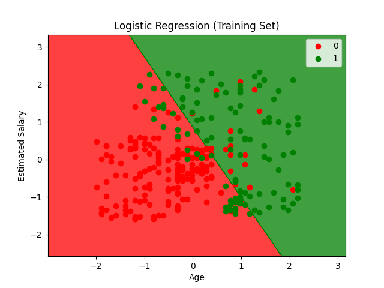

## Logistic Regression (逻辑回归)


**Logisitc Regression (逻辑回归)**，用于解决**二分类问题**。

核心目标：

> 先计算某个事件的“概率”，再根据概率判断属于哪一类。


**Logistic regression is used for a different class of problems known as classification problems.Here the aim is to predict the group to which the current object under observation belongs to.It gives you a discrete binary outcome between 0 and 1.**

逻辑回归用于一种叫做“分类问题”的任务。它的目标是预测当前观察对象属于哪一个类别。它会输出一个离散的二元结果（0 或 1）。


---


#### How Does It Work?

逻辑回归通过测量 **因变量（要预测的标签）** 和 **一个或多个自变量（特征）** 之间的关系，来估计概率。其底层使用的是逻辑函数（Logistic Function）。


**Sigmoid Function**


$$
ϕ(z)=\dfrac{1}{1+e^{-z}}
$$


Sigmoid 函数是一条 S 型曲线，它可以把任意实数映射到 0 到 1 之间。

- 输出接近 1 → 更可能属于正类

- 输出接近 0 → 更可能属于负类
  
  

#### Making Predictions

这些概率之后需要被转换成二值结果，通过“阈值分类器”进行分类。


#### Logistic vs Linear

逻辑回归输出离散结果，而线性回归输出连续结果。


---


<span style="color:purple">算法流程：</span>


```
输入特征
   ↓
线性计算
   ↓
Sigmoid函数
   ↓
得到概率
   ↓
阈值判断
   ↓
输出类别(0/1)
```

#### 

#### Step 1 | Data Pre-Processing

- 导入库

- 导入数据集

- 将数据集拆分为训练集和测试集

- 特征缩放

#### Step 2 | Logistic Regression Model

- 将逻辑回归拟合到训练集

#### Step 3 | Predection

- 预测测试集结果

#### Step 4 | Evaluating The Predection

- 制作混淆矩阵（包含模型对该数据集做出的正确预测以及错误预测）

- 可视化
  
  




```bash
Confusion Matrix:
[[65  3]         # 实际为0（未购买）：65个正确，3个错误
 [ 8 24]]        # 实际为1（购买）：24个正确，8个错误

Accuracy Score: 89.00%

Classification Report:
              precision    recall  f1-score   support

           0       0.89      0.96      0.92        68
           1       0.89      0.75      0.81        32

    accuracy                           0.89       100
   macro avg       0.89      0.85      0.87       100
weighted avg       0.89      0.89      0.89       100
```
