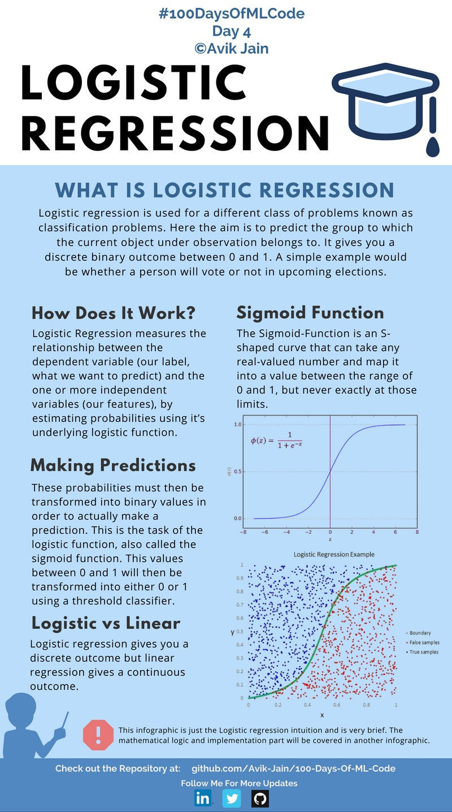
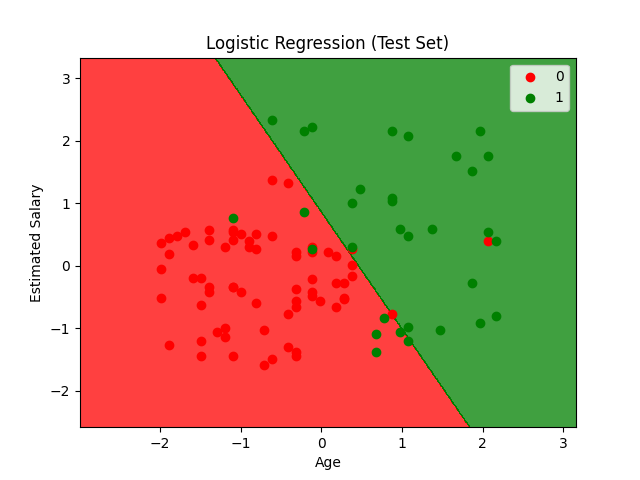

## Logistic Regression (逻辑回归)



**Logisitc Regression (逻辑回归)**，用于解决**二分类问题**。

核心目标：

> 先计算某个事件的“概率”，再根据概率判断属于哪一类。


**Logistic regression is used for a different class of problems known as classification problems.Here the aim is to predict the group to which the current object under observation belongs to.It gives you a discrete binary outcome between 0 and 1.**

逻辑回归用于一种叫做“分类问题”的任务。它的目标是预测当前观察对象属于哪一个类别。它会输出一个离散的二元结果（0 或 1）。


---


#### How Does It Work?

逻辑回归通过测量 **因变量（要预测的标签）** 和 **一个或多个自变量（特征）** 之间的关系，来估计概率。其底层使用的是逻辑函数（Logistic Function）。


**Sigmoid Function**


$$
ϕ(z)=\dfrac{1}{1+e^{-z}}
$$


Sigmoid 函数是一条 S 型曲线，它可以把任意实数映射到 0 到 1 之间。

- 输出接近 1 → 更可能属于正类

- 输出接近 0 → 更可能属于负类
  
  

#### Making Predictions

这些概率之后需要被转换成二值结果，通过“阈值分类器”进行分类。


#### Logistic vs Linear

逻辑回归输出离散结果，而线性回归输出连续结果。


---


<span style="color:purple">算法流程：</span>


```
输入特征
   ↓
线性计算
   ↓
Sigmoid函数
   ↓
得到概率
   ↓
阈值判断
   ↓
输出类别(0/1)
```

#### Code

```python
import numpy as np
import matplotlib.pyplot as plt
import pandas as pd
from sklearn.model_selection import train_test_split
from sklearn.preprocessing import StandardScaler
from sklearn.linear_model import LogisticRegression
from sklearn.metrics import confusion_matrix, accuracy_score, classification_report
```

> 导入库
> - `numpy` 数值计算库
> - `matplotlib.pyplot` 数据可视化
> - `pandas` 数据处理
> - `train_test_split` 数据拆分
> - `StandardScaler` 特征缩放
> - `LogisticRegression` 逻辑回归模型
> - `confusion_matrix` 混淆矩阵
> - `accuracy_score` 准确率
> - `classification_report` 分类报告

```python
def load_dataset(file_path):
    import os
    
    script_dir = os.path.dirname(os.path.abspath(__file__))
    full_path = os.path.join(script_dir, file_path)

    dataset = pd.read_csv(full_path)
    X = dataset.iloc[:, [2, 3]].values
    y = dataset.iloc[:, 4].values
    return X, y
```

> 导入数据集

```python
def preprocess_data(X, y, test_size=0.25, random_state=0):
    X_train, X_test, y_train, y_test = train_test_split(X, y, test_size=test_size, random_state=random_state)
    
    sc = StandardScaler()
    X_train = sc.fit_transform(X_train)
    X_test = sc.transform(X_test)
    
    return X_train, X_test, y_train, y_test, sc
```

> 数据预处理
> - 将数据集拆分为训练集和测试集
> - 特征缩放

```python
def train_model(X_train, y_train):
    classifier = LogisticRegression(random_state=0)
    classifier.fit(X_train, y_train)
    return classifier
```

> 训练逻辑回归模型
> 为什么需要特征缩放？
> - 年龄和收入数值范围差异很大
> - 特征缩放让不同特征在相同尺度上比较
> - 加快模型收敛速度，提高分类精度

```python
def evaluate_model(y_test, y_pred):
    cm = confusion_matrix(y_test, y_pred)
    accuracy = accuracy_score(y_test, y_pred)
    report = classification_report(y_test, y_pred)
    
    print("Confusion Matrix:")
    print(cm)
    print("\nAccuracy Score: {:.2f}%".format(accuracy * 100))
    print("\nClassification Report:")
    print(report)
    
    return cm, accuracy, report
```

> 评估模型
> `Precision` 精确率    $TP / (TP + FP)$
> `Recall` 召回率    $TP / (TP + FN)$
> `F1-score` 平衡值  $2 × (P × R) / (P + R)$
> `Support` 样本数

```python
def plot_decision_boundary(X, y, classifier, title):
    from matplotlib.colors import ListedColormap
    
    X_set, y_set = X, y
    X1, X2 = np.meshgrid(np.arange(start=X_set[:, 0].min() - 1, stop=X_set[:, 0].max() + 1, step=0.01),
                         np.arange(start=X_set[:, 1].min() - 1, stop=X_set[:, 1].max() + 1, step=0.01))
    
    plt.contourf(X1, X2, classifier.predict(np.array([X1.ravel(), X2.ravel()]).T).reshape(X1.shape),
                 alpha=0.75, cmap=ListedColormap(('red', 'green')))
    
    plt.xlim(X1.min(), X1.max())
    plt.ylim(X2.min(), X2.max())
    
    for i, j in enumerate(np.unique(y_set)):
        plt.scatter(X_set[y_set == j, 0], X_set[y_set == j, 1],
                    c=ListedColormap(('red', 'green'))(i), label=j)
    
    plt.title(title)
    plt.xlabel('Age')
    plt.ylabel('Estimated Salary')
    plt.legend()
    plt.show()
```

> 步骤：
> 1. 创建网格：将年龄和收入范围划分为密密麻麻的网格点
>    - X1: 年龄网格
>    - X2: 收入网格
> 2. 预测每个网格点：对每个网格点预测其类别（0或1）
> 3. 填充颜色：
>    - 红色区域：预测为"未购买"
>    - 绿色区域：预测为"购买"
> 4. 叠加散点：显示真实数据分布
> 决策边界：红绿区域的交界线（逻辑回归是线性边界）

```python
if __name__ == "__main__":
    # Load dataset
    X, y = load_dataset('Social_Network_Ads.csv')
    
    # Preprocess data
    X_train, X_test, y_train, y_test, sc = preprocess_data(X, y)
    
    # Train model
    classifier = train_model(X_train, y_train)
    
    # Predict
    y_pred = classifier.predict(X_test)
    
    # Evaluate
    evaluate_model(y_test, y_pred)
    
    # Visualize results
    plot_decision_boundary(X_train, y_train, classifier, 'Logistic Regression (Training Set)')
    plot_decision_boundary(X_test, y_test, classifier, 'Logistic Regression (Test Set)')
```

#### Results
  





```bash
Confusion Matrix:
[[65  3]         # 实际为0（未购买）：65个正确，3个错误
 [ 8 24]]        # 实际为1（购买）：24个正确，8个错误

Accuracy Score: 89.00%

Classification Report:
              precision    recall  f1-score   support

           0       0.89      0.96      0.92        68
           1       0.89      0.75      0.81        32

    accuracy                           0.89       100
   macro avg       0.89      0.85      0.87       100
weighted avg       0.89      0.89      0.89       100
```
