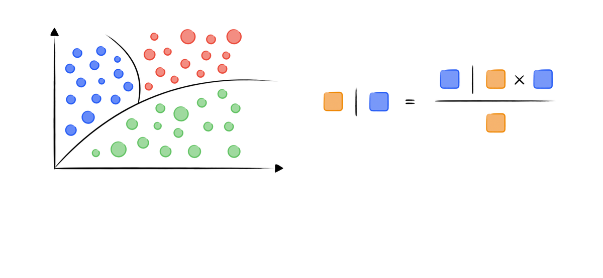
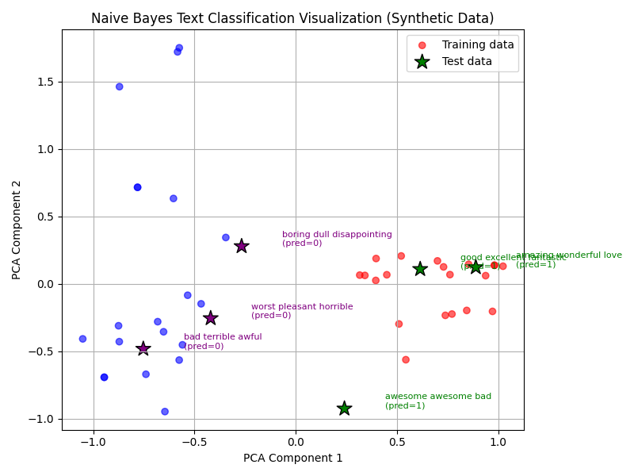

Naive Bayes（朴素贝叶斯）
-----------


**Naive Bayes (朴素贝叶斯)** 是一类**贝叶斯定理**与**特征条件独立假设**的**概率分类算法**。它以简单、高效、易于实现著称，广泛应用于文本分类、垃圾邮件过滤、情感分析等领域。

- **核心思想**：假设各特征之间相互独立，通过贝叶斯定理计算后验概率，选择概率最大的类别作为预测结果。

- **常见类型**：高斯朴素贝叶斯、伯努利朴素贝叶斯、多项式朴素贝叶斯。
  
  

---


#### 数学原理


**1. 贝叶斯定理**


$P(y|x)=\frac{P(x|y)P(y)}{P(x)}$


- $y$ ：类别标签

- $x$ ：特征向量

- $P(y|x)$ ：在已知 $x$ 时属于类别 $y$ 的后验概率

- $P(x|y)$ ：在类别 $y$ 下观测到的 $x$ 的概率（似然）

- $P(y)$ ：类别 $y$ 先验概率

- $P(x)$ ：观测到 $x$ 的概率（归一化常数）
  
  

**2. 条件独立假设**

朴素贝叶斯假设各特征在类别已知的情况下**相互独立**，即：


$P(x \mid y) = \prod_{i=1}^{n} P(x_i \mid y)$


这样极大地简化了多特征联合概率的计算。


**3. 分类决策规则**

对于给定样本 $x$ ，预测类别为：


$\hat{y} = \arg\max_{y} P(y) \prod_{i=1}^{n} P(x_i \mid y)$


通常用对数化简为：


$\hat{y} = \arg\max_{y} \left[ \log P(y) + \sum_{i=1}^{n} \log P(x_i \mid y) \right]$




---


<span style="color:purple">算法流程：</span>


**Step 1：准备数据**

- 收集特征和类别标签，常见于文本、二值、计数等数据。

- 可选：对文本数据进行分词、向量化等预处理。

**Step 2：计算先验概率**

- 统计每个类别在训练集中的频率，得到 $P(y)$

**Step 3：计算条件概率**

- 对每个特征 $x_i$ 和类别 $y$ ，统计 $P(x_i|y)$ 。

- 不同类型的朴素贝叶斯有不同的条件概率建模方法

**Step 4：预测新样本**

- 对于新样本 $x$， 用上述公式计算每个类别的后验概率

- 选择概率最大的类别作为预测结果。

**Step 5：模型评估**

- 用测试集评估准确率、混淆矩阵等指标。

- 可绘制ROC曲线、学习曲线等。
  
  

#### Code

```python
import numpy as np
import matplotlib.pyplot as plt
from sklearn.naive_bayes import MultinomialNB
from sklearn.feature_extraction.text import CountVectorizer
from sklearn.decomposition import PCA
```

> 导入库
> `MultinomialNB` 多项式朴素贝叶斯分类器（适合文本分类）
> `CountVectorizer` 将文本转换为词频向量
> `PCA` 主成分分析（降维用于可视化）

```pyhton
# 1. Create a synthetic, clearly separable dataset
positive_words = ["good", "excellent", "fantastic", "amazing", "wonderful", "love", "great", "awesome", "nice", "pleasant"]
negative_words = ["bad", "terrible", "awful", "horrible", "hate", "worst", "boring", "poor", "dull", "disappointing"]

np.random.seed(0)

# 20 positive and 20 negative samples
texts = []
labels = []
for _ in range(20):
    sample = " ".join(np.random.choice(positive_words, size=3, replace=True))
    texts.append(sample)
    labels.append(1)
for _ in range(20):
    sample = " ".join(np.random.choice(negative_words, size=3, replace=True))
    texts.append(sample)
    labels.append(0)
```

> 创建合成数据集
> 生成20个积极和20个消极的文本样本，每个样本包含3个随机选择的单词。

```pyhton
# 2. Vectorize
vectorizer = CountVectorizer()
X = vectorizer.fit_transform(texts)
```

> 文本向量化
> CountVectorizer 做了什么？
> 
> 1. 构建词汇表（所有出现的词）
> 2. 将每个文本转换为词频向量
> 3. 向量维度 = 词汇表大小

```python
# 3. Train Naive Bayes
nb = MultinomialNB()
nb.fit(X, labels)
```

> 训练朴素贝叶斯分类器
> 多项式朴素贝叶斯分类器（MultinomialNB）用于文本分类，假设特征之间独立，每个特征的出现次数作为特征值。

```python
# 4. Prepare test samples
test_texts = [
    "good excellent fantastic",   # positive
    "bad terrible awful",         # negative
    "amazing wonderful love",     # positive
    "boring dull disappointing",  # negative
    "awesome awesome bad",        # mixed
    "worst pleasant horrible",    # mixed
]
X_test = vectorizer.transform(test_texts)
y_pred = nb.predict(X_test)
```

> 预测新样本
> 对测试样本进行分类，得到预测类别。

```python
# 5. Project to 2D for visualization
pca = PCA(n_components=2, random_state=42)
X_all = np.vstack([X.toarray(), X_test.toarray()])
X_all_2d = pca.fit_transform(X_all)
X_2d = X_all_2d[:len(X.toarray())]
X_test_2d = X_all_2d[len(X.toarray()):]
```

> 降维可视化
> 将高维文本向量降到2维，方便可视化。

```python
# 6. Plot training data
plt.figure(figsize=(8, 6))
colors = ['red' if label == 1 else 'blue' for label in labels]
plt.scatter(X_2d[:, 0], X_2d[:, 1], c=colors, alpha=0.6, label='Training data')

# 7. Plot test data
test_colors = ['green' if pred == 1 else 'purple' for pred in y_pred]
plt.scatter(X_test_2d[:, 0], X_test_2d[:, 1], c=test_colors, marker='*', s=200, edgecolor='k', label='Test data')
for i, txt in enumerate(test_texts):
    plt.annotate(f"{txt}\n(pred={y_pred[i]})", (X_test_2d[i, 0]+0.2, X_test_2d[i, 1]), fontsize=8, color=test_colors[i])

plt.xlabel('PCA Component 1')
plt.ylabel('PCA Component 2')
plt.title('Naive Bayes Text Classification Visualization (Synthetic Data)')
plt.legend()
plt.grid(True)
plt.tight_layout()
plt.show()
```

> 绘制可视化结果

```python
# 8. Output predictions
for text, pred in zip(test_texts, y_pred):
    print(f'"{text}": predicted class {pred}')
```

> 输出预测结果


 

#### Results




- PCA降维 ：将高维文本向量降到2维方便可视化
- 数据分离 ：积极和消极情感的文本在空间上明显分开
- 预测准确 ：测试样本（绿色星号）被正确分类到对应的区域

```bash
"good excellent fantastic": predicted class 1
"bad terrible awful": predicted class 0
"amazing wonderful love": predicted class 1
"boring dull disappointing": predicted class 0
"awesome awesome bad": predicted class 1
"worst pleasant horrible": predicted class 0
```
