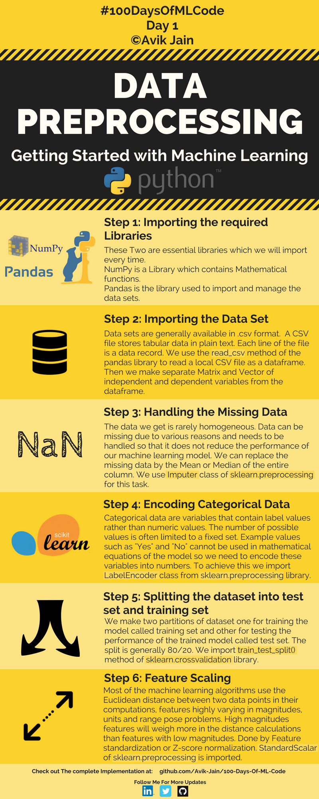

_**As an ordinary sophomore with no resources and no platform,      
I can only record my learning path of machine learning in this way.😅**_

本项目复现参考并续写 [100-Days-of-ML-Code](https://github.com/Avik-Jain/100-Days-Of-ML-Code)

## 学习笔记

### Data PreProcessing

### 线性回归

- [简单线性回归](Linear-Regression/Simple-Linear-Regression/Simple-LR.md)
- [多元线性回归](Linear-Regression/Multiple-Linear-Regression/Multiple-LR.md)

### 逻辑回归

- [逻辑回归](Logistic-Regression/Logisitc-Regression.md)

### K 近邻

- [K 近邻](K-Nearest-Neightbors/KNN.md)

### SVM

- [SVM](Support-Vector-Machines/SVM.md)

### Decision Trees

- [Decision Trees](Decision-Trees/Decision_Trees.md)

### Random Forest

- [Random Forest](Random-Forests/Random-Forests.md)

### K-Means-Clustering

- [K-Means-Clustering](K-Means-Clustering/K-Means.md)

