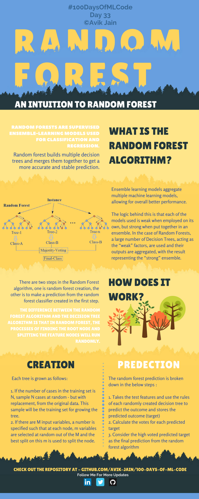
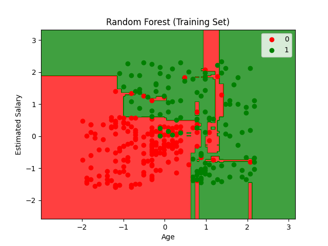
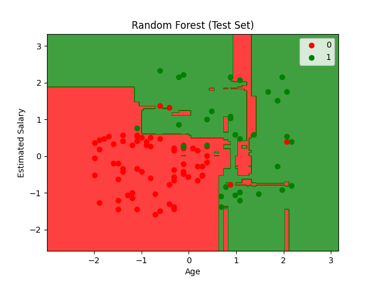

## Random Forests (随机森林)



**Random Forest (随机森林)**，是一种 **监督学习** 的 **集成学习** 算法，可用于分类和回归。

> 通过构建多个决策树，并将它们的结果进行融合。


**Ensemble learning models aggregate multiple machine learning models, allowing for overall better performance.The logic behind this is that each of the models used is weak when employed on its own, but strong when put together in an ensemble.**

集成学习模型通过整合多个机器学习模型，从而实现整体性能的提升。其背后的逻辑在于：单独使用时，构成集成的各个模型往往表现较弱；但当它们被整合在一起形成集成模型时，其整体能力便会变得强大。

> 利用 **多数投票 (Majority Voting)** 机制


---


#### How Does It Work?

随机森林算法包含两个步骤：一是构建随机森林；二是利用第一步所构建的随机森林分类器进行预测。

随机森林算法与决策树算法的区别在于，在随机森林中，寻找根节点以及拆分特征节点的过程是随机进行的。


**Creation**

每棵树按照以下方式生成：

1. Bootstrap Sampling    →    让每棵树看到的数据不同，降低过拟合
   如果训练集有 N 个样本，从中随机抽取 N 次样本（有放回抽样）。

```
A B C D E -- 原始数据
A C C D E -- 抽样后
```

2. Feature Randomness    →    让每棵树关注的信息不同，提高泛化能力
   故意让每棵树从不同角度看问题，从而提高整个森林投票结果的可靠性。
   
   

**Prediction**

随机森林预测过程如下：

1. 将测试样本输入每棵决策树
2. 每棵树独立预测结果
3. 统计所有树的预测结果
4. 输出最终结果
   
   

**分类任务**

采用 **Majority Voting（多数投票）**

e.g.

```
树1：猫
树2：狗
树3：狗
树4：狗
树5：猫

# 统计
猫：2票
狗：3票

预测 = 狗
```


**回归任务**

采用 **Average（平均值）**

```
树1：100万
树2：120万
树3：110万


预测房价 = (100+120+110)/3 = 110万
```


| 特性    | 决策树 | 随机森林 |
| ----- | --- | ---- |
| 模型数量  | 1棵树 | 多棵树  |
| 训练速度  | 快   | 较慢   |
| 容易过拟合 | 是   | 不容易  |
| 稳定性   | 较差  | 较好   |
| 泛化能力  | 一般  | 强    |
| 可解释性  | 很强  | 较弱   |


---


<span style="color:purple">算法流程：</span>


```
                原始训练集
                      │
          ┌───────────┼───────────┐
          │           │           │
          ▼           ▼           ▼
     Bootstrap1  Bootstrap2  Bootstrap3
          │           │           │
          ▼           ▼           ▼
       Tree1       Tree2       Tree3
    (随机特征)   (随机特征)   (随机特征)
          │           │           │
          └───────┬───┴───────┬───┘
                  │
                  ▼
           Random Forest
                  │
           新样本输入
                  │
        ┌─────────┼─────────┐
        ▼         ▼         ▼
      Tree1     Tree2     Tree3
       │          │          │
       ▼          ▼          ▼
      类A        类B        类A
        └─────────┬─────────┘
                  ▼
              多数投票
                  ▼
               最终结果
```


<span style="color:purple">伪代码：</span>


```
Input:
    Training Data D
    Number of Trees K

For i = 1 to K:

    1. 从D中Bootstrap抽样得到Di

    2. 用Di训练决策树Ti

        对于每个节点:
            随机选择m个特征
            选取最优划分特征
            分裂节点

Output:
    Forest = {T1,T2,...,Tk}


```Prediction```

For each Tree Ti:

    yi = Ti(x)

分类:
    vote(y1,y2,...,yk)

回归:
    mean(y1,y2,...,yk)
```


#### Code

```python
import numpy as np
import matplotlib.pyplot as plt
import pandas as pd
import os
from sklearn.model_selection import train_test_split
from sklearn.preprocessing import StandardScaler
from sklearn.ensemble import RandomForestClassifier
from sklearn.metrics import confusion_matrix, accuracy_score, classification_report
```

> 导入库
> `RandomForestClassifier` 随机森林分类器 ，集成学习方法
> `sklearn.ensemble` 集成学习模块

```python
def load_dataset(file_path):
    script_dir = os.path.dirname(os.path.abspath(__file__))
    full_path = os.path.join(script_dir, file_path)
    dataset = pd.read_csv(full_path)
    X = dataset.iloc[:, [2, 3]].values
    y = dataset.iloc[:, 4].values
    return X, y
```

> 加载数据

```python
def preprocess_data(X, y, test_size=0.25, random_state=0):
    X_train, X_test, y_train, y_test = train_test_split(
        X, y, test_size=test_size, random_state=random_state
    )

    sc = StandardScaler()
    X_train = sc.fit_transform(X_train)
    X_test = sc.transform(X_test)

    return X_train, X_test, y_train, y_test, sc
```

> 数据预处理

```python
def train_random_forest(X_train, y_train, n_estimators=10, criterion='entropy', random_state=0):
    classifier = RandomForestClassifier(
        n_estimators=n_estimators,
        criterion=criterion,
        random_state=random_state
    )
    classifier.fit(X_train, y_train)
    return classifier
```

> 训练随机森林
> n_estimators=1：就是单一决策树，可能过拟合，不稳定
> n_estimators=10：基本的随机森林，已经有一定的集成效果
> n_estimators=100：更稳健的模型，训练时间更长，但通常效果更好
> n_estimators=1000：非常稳健，训练时间很长，边际收益递减

```python
def evaluate_model(y_test, y_pred):
    cm = confusion_matrix(y_test, y_pred)
    accuracy = accuracy_score(y_test, y_pred)
    report = classification_report(y_test, y_pred)

    print("Confusion Matrix:")
    print(cm)
    print("\nAccuracy Score: {:.2f}%".format(accuracy * 100))
    print("\nClassification Report:")
    print(report)

    return cm, accuracy, report
```

> 评估模型

```python
def plot_decision_boundary(X, y, classifier, title):
    from matplotlib.colors import ListedColormap

    X_set, y_set = X, y
    X1, X2 = np.meshgrid(
        np.arange(start=X_set[:, 0].min() - 1, stop=X_set[:, 0].max() + 1, step=0.01),
        np.arange(start=X_set[:, 1].min() - 1, stop=X_set[:, 1].max() + 1, step=0.01)
    )

    plt.contourf(X1, X2, classifier.predict(np.array([X1.ravel(), X2.ravel()]).T).reshape(X1.shape),
                 alpha=0.75, cmap=ListedColormap(('red', 'green')))

    plt.xlim(X1.min(), X1.max())
    plt.ylim(X2.min(), X2.max())

    for i, j in enumerate(np.unique(y_set)):
        plt.scatter(X_set[y_set == j, 0], X_set[y_set == j, 1],
                    c=ListedColormap(('red', 'green'))(i), label=j)

    plt.title(title)
    plt.xlabel('Age')
    plt.ylabel('Estimated Salary')
    plt.legend()
    plt.show()
```

> 绘制决策边界
> 可视化随机森林模型的分类边界

```python
if __name__ == "__main__":
    X, y = load_dataset('Social_Network_Ads.csv')

    X_train, X_test, y_train, y_test, sc = preprocess_data(X, y)

    classifier = train_random_forest(X_train, y_train, n_estimators=10, criterion='entropy', random_state=0)

    y_pred = classifier.predict(X_test)

    evaluate_model(y_test, y_pred)

    plot_decision_boundary(X_train, y_train, classifier, 'Random Forest (Training Set)')
    plot_decision_boundary(X_test, y_test, classifier, 'Random Forest (Test Set)')
```

#### Results








```bash
Confusion Matrix:
[[63  5]
 [ 4 28]]

Accuracy Score: 91.00%

Classification Report:
              precision    recall  f1-score   support

           0       0.94      0.93      0.93        68
           1       0.85      0.88      0.86        32

    accuracy                           0.91       100
   macro avg       0.89      0.90      0.90       100
weighted avg       0.91      0.91      0.91       100
```


|    特性    |        单一决策树        |       随机森林       |
| :--------: | :----------------------: | :------------------: |
| 过拟合风险 |  高（容易记住训练数据）  | 低（多棵树投票平均） |
|   稳定性   | 低（微小数据变化影响大） |   高（多棵树综合）   |
|  训练速度  |            快            |          慢          |
|  预测速度  |            快            |         较慢         |
|  可解释性  |    高（可以画树形图）    |     低（黑盒子）     |

