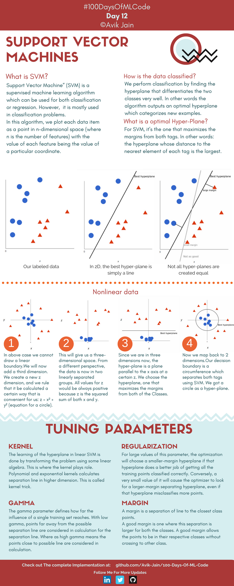
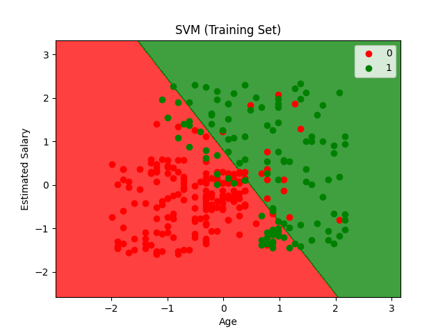
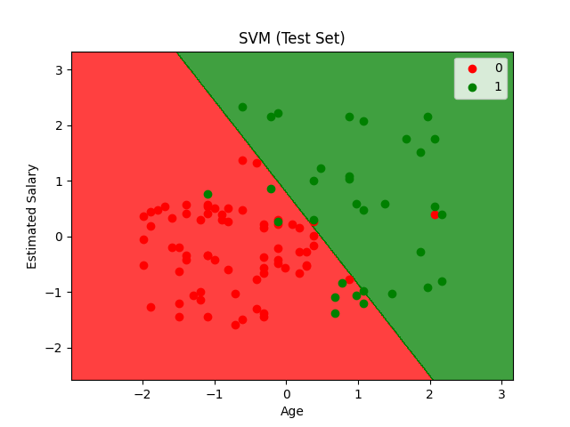

## Support Vector Machines (支持向量机)



**Support Vector Machines (支持向量机)**，常用于分类问题。


**In this algorithm,we plot each data item as a point in n-dimensional space (where n is the number of features) with the value of each feature being the value of a particular coordinate.**

在该算法中，我们将每一个数据项在 n 维空间（其中 n 为特征数量）中绘制为一个点，其中每个特征的取值即为对应坐标的数值。


---


#### How is the data classified?

> 算法输出一个最优超平面来对新样本进行分类

寻找一个能很好地将两个类别区分开的超平面（Hyperplane）来进行分类。


#### What is an optimal Hyper-plane?

对于 SVM 来说，最优超平面是指能让两个类别的边距（Margin）达到最大化的平面。换句话说：该超平面到每个类别中最近元素的距离是最大的。

> 支持向量 = 距离超平面（决策边界）最近的那些数据点 (它们位于"间隔"的边缘上)


---


#### Nonlinear data

* **步骤 1**：在上述情况下，我们无法绘制线性边界。因此，我们现在引入第三个维度。我们创建一个新的 $z$ 轴维度，并规定以一种对我们便利的特定方式来计算它：$z = x^2 + y^2$（圆的方程）。

* **步骤 2**：这将给我们一个三维空间。从另一个视角来看，数据现在被分成了线性可分的两组。由于 $z$ 是 $x$ 和 $y$ 的平方和，所以 $z$ 的值永远是正数。

* **步骤 3**：既然我们现在处于三维空间中，超平面就是一个在特定 $z$ 轴高度上平行于 $x$ 轴的**平面**。我们选择那个能使两个类别的边距最大化的超平面。

* **步骤 4**：现在我们映射回二维空间。我们的决策边界变成了一个圆周，它在 SVM 的帮助下将两个标签分离开来。我们在二维中得到了一个圆作为“超平面”。
  
  

这就是 SVM 中 **Kernel Trick (核技巧)** 的直观体现。

想象桌子上混杂着红蓝两种纽扣，蓝色的在中间，红色的在外围。你在桌面上画不出来一条直线的边界。

* **SVM 的做法**：一拍桌子，让所有纽扣飞到空中（**映射到高维空间**）。因为蓝色的纽扣在中心（ $x, y$ 较小），通过 $z = x^2 + y^2$ 计算后，它们飞得比较低；而红色的纽扣在外围（ $x, y$ 较大），它们飞得非常高。

* **空中切一刀**：这时候，你可以在空中水平插进一张纸（**三维超平面**），把飞得高的红纽扣和飞得低的蓝纽扣完美切开。

* **落回桌面**：当纸投射回桌面时，它在桌面上留下的投影恰好就是一个**圆圈**。
  
  

---


#### Tuning Parameters


- **Kernel（核函数）**
  在线性 SVM 中，超平面的学习是通过使用一些线性代数转换问题来完成的。这就是核函数发挥作用的地方。多项式（Polynomial）和指数（Exponential）核函数可以在更高维度计算分离线。这被称为**核技巧（Kernel Trick）**。
  
  > 它决定了你用什么“魔术”把低维数据变到高维去。是变成圆锥状、波浪状还是其他形状？常见的有线性核、多项式核和 RBF（高斯）核。

  ```python
  # 线性核
  classifier = train_svm_model(X_train, y_train, kernel='linear')
  
  # 径向基核（处理非线性）
  classifier = train_svm_model(X_train, y_train, kernel='rbf')
  
  # 多项式核
  classifier = train_svm_model(X_train, y_train, kernel='poly', degree=3)
  ```
  
- **Regularization（正则化 / C参数）**
  对于该参数的**较大值**，如果超平面能更好地将所有训练点正确分类，优化器将选择一个较小边距的超平面。相反，一个**极小的值**会导致优化器寻找一个拥有更大边距的分离超平面，即使该超平面会误分类更多的点。
  
  > 相当于**对错误的容忍度**。
  > • **C 很大**：绝对不能容忍错误！分类线会弯弯曲曲极力避开所有错点，容易导致**过拟合**。
  > • **C 很小**：大度、看大局。为了让隔离带（Margin）更宽，允许少数点被划错，泛化能力更好。

- **Gamma $\gamma$**
  Gamma 参数定义了单个训练样本的影响力能达到多远。**低 Gamma** 意味着距离可能的分离线较远的点也会被纳入分离线的计算中；而**高 Gamma** 则意味着只有距离可能的分离线较近的点才会被纳入计算。
  
  > 决定了分类器**听取哪些点的意见**。
  > • **Gamma 高**：分类器很“近视”，只看分类线附近的几个点（支持向量），地形容易变得很复杂，容易**过拟合**。
  > • **Gamma 低**：分类器看得远，连远处的点也要参考，分类线会更加平滑。

- **Maigin（边距）**
  边距是分离线到最近的类别点之间的距离。一个好的边距是指该分离距离对两个类别来说都是最大的。良好的边距允许点待在各自的类别中，而不跨越到另一个类别。
  
  > SVM 的终极追求。**边距越宽，模型的底气越足**，面对没见过的新数据时预测得就越准。
  
  

---


<span style="color:purple">**算法流程**：</span>


```
构建初始决策边界
     ↓
最大化几何间隔 (Margin)
     ↓
引入约束条件
     ↓
利用拉格朗日对偶性求解
     ↓
(处理非线性)引入核函数
```


数据集同 [逻辑回归](Logistic Regression/Logisitc Regression.md)


#### Code


```python
import numpy as np
import matplotlib.pyplot as plt
import pandas as pd
import os
from sklearn.model_selection import train_test_split
from sklearn.preprocessing import StandardScaler
from sklearn.svm import SVC
from sklearn.metrics import confusion_matrix, accuracy_score, classification_report
```

> 导入库
> `SVC` Support Vector Classifier ，支持向量分类器

```python
def load_dataset(file_path):
    script_dir = os.path.dirname(os.path.abspath(__file__))
    full_path = os.path.join(script_dir, file_path)
    dataset = pd.read_csv(full_path)
    X = dataset.iloc[:, [2, 3]].values # 年龄、预估收入
    y = dataset.iloc[:, 4].values      # 是否购买（0或1）
    return X, y
```

> 加载数据

```python
def preprocess_data(X, y, test_size=0.25, random_state=0):
    X_train, X_test, y_train, y_test = train_test_split(
        X, y, test_size=test_size, random_state=random_state
    )

    sc = StandardScaler()
    X_train = sc.fit_transform(X_train)
    X_test = sc.transform(X_test)

    return X_train, X_test, y_train, y_test, sc
```

> 数据预处理 （特征缩放）

```python
def train_svm_model(X_train, y_train, kernel='linear', random_state=0):
    classifier = SVC(kernel=kernel, random_state=random_state)
    classifier.fit(X_train, y_train)
    return classifier
```

> 训练 SVM 模型

```python
def evaluate_model(y_test, y_pred):
    cm = confusion_matrix(y_test, y_pred)
    accuracy = accuracy_score(y_test, y_pred)
    report = classification_report(y_test, y_pred)

    print("Confusion Matrix:")
    print(cm)
    print("\nAccuracy Score: {:.2f}%".format(accuracy * 100))
    print("\nClassification Report:")
    print(report)

    return cm, accuracy, report
```

> 评估模型性能

```python
def plot_decision_boundary(X, y, classifier, title):
    from matplotlib.colors import ListedColormap

    X_set, y_set = X, y
    X1, X2 = np.meshgrid(
        np.arange(start=X_set[:, 0].min() - 1, stop=X_set[:, 0].max() + 1, step=0.01),
        np.arange(start=X_set[:, 1].min() - 1, stop=X_set[:, 1].max() + 1, step=0.01)
    )

    plt.contourf(X1, X2, classifier.predict(np.array([X1.ravel(), X2.ravel()]).T).reshape(X1.shape),
                 alpha=0.75, cmap=ListedColormap(('red', 'green')))

    plt.xlim(X1.min(), X1.max())
    plt.ylim(X2.min(), X2.max())

    for i, j in enumerate(np.unique(y_set)):
        plt.scatter(X_set[y_set == j, 0], X_set[y_set == j, 1],
                    c=ListedColormap(('red', 'green'))(i), label=j)

    plt.title(title)
    plt.xlabel('Age')
    plt.ylabel('Estimated Salary')
    plt.legend()
    plt.show()
```

> 绘制决策边界图

```python
if __name__ == "__main__":
    X, y = load_dataset('Social_Network_Ads.csv')

    X_train, X_test, y_train, y_test, sc = preprocess_data(X, y)

    classifier = train_svm_model(X_train, y_train, kernel='linear', random_state=0)

    y_pred = classifier.predict(X_test)

    evaluate_model(y_test, y_pred)

    plot_decision_boundary(X_train, y_train, classifier, 'SVM (Training Set)')
    plot_decision_boundary(X_test, y_test, classifier, 'SVM (Test Set)')
```


#### Results








```bash
Confusion Matrix:
[[66  2]
 [ 8 24]]

Accuracy Score: 90.00%

Classification Report:
              precision    recall  f1-score   support

           0       0.89      0.97      0.93        68
           1       0.92      0.75      0.83        32

    accuracy                           0.90       100
   macro avg       0.91      0.86      0.88       100
weighted avg       0.90      0.90      0.90       100
```


---


|     特性     |         SVM          | 逻辑回归 |        KNN         |
| :----------: | :------------------: | :------: | :----------------: |
|     类型     |    最大间隔分类器    | 概率模型 |      基于实例      |
|   决策边界   |     线性或非线性     |   线性   |       非线性       |
|   训练速度   |         中等         |    快    |      无需训练      |
|   预测速度   | 快（只依赖支持向量） |    快    | 慢（计算所有距离） |
|   内存消耗   | 中等（存储支持向量） |    低    | 高（存储所有数据） |
| 对特征的缩放 |       非常敏感       |   需要   |      非常敏感      |

